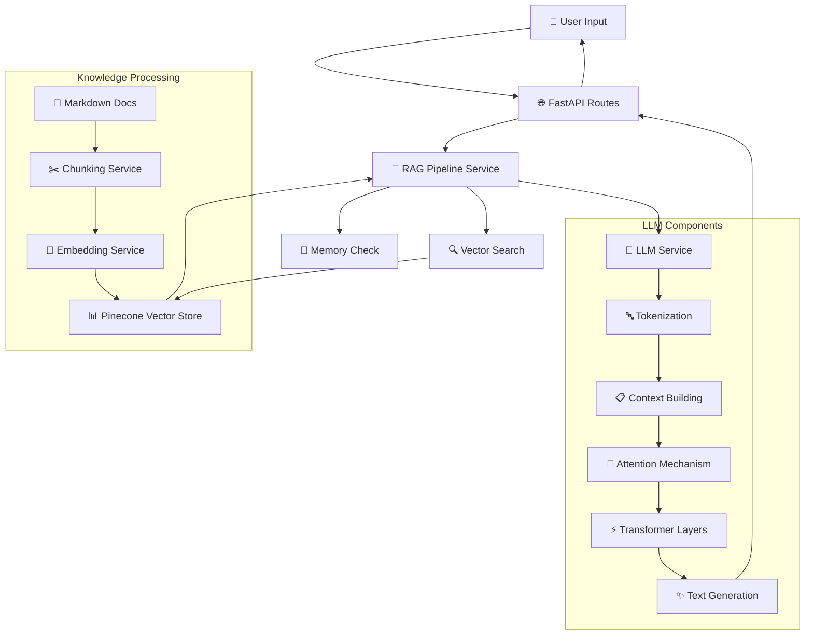
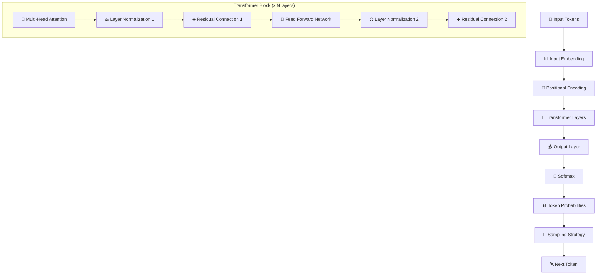
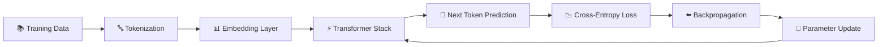
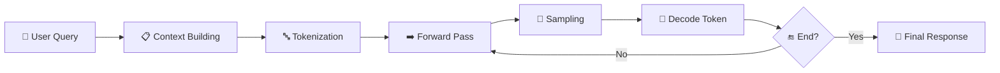
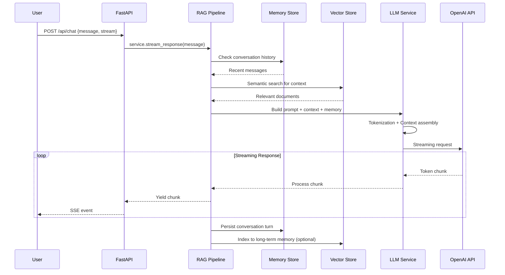

# LLM Analysis Detail - RAG System Architecture & Flow

## 📖 Tổng quan hệ thống

Project này implement một **RAG (Retrieval-Augmented Generation) System** sử dụng **OpenAI GPT models** kết hợp với **Pinecone vector database** để tạo ra một chatbot có khả năng tham khảo knowledge base và duy trì memory conversation.

## 🔄 Data Flow Overview



---

## 1️⃣ Input Processing & API Layer

### 1.1 FastAPI Routes (`/api/chat`)

```python
# Từ app/api/routes.py
@router.post("/api/chat")
async def chat(request: ChatRequest):
    service = get_rag_service()
    
    if request.stream:
        # Server-Sent Events streaming
        async def event_generator():
            async for chunk in service.stream_response(request.message):
                if chunk:
                    yield f"data: {chunk}\n\n"
            yield "data: [DONE]\n\n"
        
        return StreamingResponse(event_generator(), media_type="text/event-stream")
    else:
        # Non-streaming JSON response
        response = service.chat(request.message)
        return ChatResponse(response=response)
```

**Key Points:**
- **Input**: User message trong `ChatRequest`
- **Output options**: 
  - **Streaming**: Server-Sent Events cho real-time response
  - **Non-streaming**: JSON response trọn vẹn
- **Error handling**: HTTPException với detailed error messages

---

## 2️⃣ RAG Pipeline Service - Core Orchestrator

### 2.1 Pipeline Initialization

```python
# Từ app/services/rag/rag_pipeline_service.py
def __init__(self, ...):
    # Initialize sub-services
    self.chunking_service = ChunkingService(...)
    self.embedding_service = EmbeddingService(...)
    self.vector_store_service = VectorStoreService(...)
    self.search_service = SemanticSearchService(...)
    self.ranking_service = RankingService(...)
    self.llm_service = LLMService(...)
```

### 2.2 Chat Processing Flow

```python
def chat(self, query: str) -> str:
    # 1. Moderation check
    if not self.llm_service.moderation_hook(query):
        return "Message blocked by content policy."
    
    # 2. Memory persistence
    self.llm_service._append_memory("user", query)
    
    # 3. Build combined context (Memory + KB)
    system_prompt = self._build_combined_system(query)
    messages = [("system", system_prompt), ("user", query)]
    
    # 4. Agent execution với React pattern
    response = self.agent_executor.invoke({"messages": messages})
    
    # 5. Extract & persist assistant response
    assistant_text = self._extract_response(response)
    self._persist_assistant_turn(assistant_text)
    
    return assistant_text
```

---

## 3️⃣ Knowledge Base Processing

### 3.1 Document Chunking

```python
# Chunking Service - chia documents thành các chunks nhỏ
class ChunkingService:
    def process(self, data_dir: Path) -> List[Document]:
        chunks = []
        for md_file in data_dir.glob("*.md"):
            content = md_file.read_text()
            
            # Text splitting với RecursiveCharacterTextSplitter
            text_splitter = RecursiveCharacterTextSplitter(
                chunk_size=self.chunk_size,
                chunk_overlap=self.chunk_overlap,
                separators=["\n\n", "\n", " ", ""]
            )
            
            splits = text_splitter.split_text(content)
            
            for split in splits:
                # Add section headers for context
                if self.add_section_headers:
                    split = self._add_context_headers(split, content)
                
                chunks.append(Document(
                    page_content=split,
                    metadata={"source": str(md_file), "chunk_id": len(chunks)}
                ))
        
        return chunks
```

**Chunking Strategy:**
- **Recursive splitting**: Ưu tiên split theo paragraph → sentence → word → character
- **Overlap**: Giữ lại context giữa các chunks liền kề
- **Section context**: Thêm section headers vào chunks để tăng context relevance

### 3.2 Embedding Generation

```python
# Embedding Service - convert text thành vectors
class EmbeddingService:
    def generate_embeddings(self, texts: List[str]) -> List[List[float]]:
        # 1. Cache check
        cached_embeddings = []
        texts_to_embed = []
        
        for text in texts:
            cached = self._cache_get(text)
            if cached:
                cached_embeddings.append(cached)
            else:
                texts_to_embed.append(text)
        
        # 2. Batch embedding generation
        if texts_to_embed:
            raw_embeddings = self.embeddings.embed_documents(texts_to_embed)
            
            # 3. PCA dimension reduction (optional)
            if self.pca_components:
                raw_embeddings = self._apply_pca(raw_embeddings)
            
            # 4. Cache results
            for text, emb in zip(texts_to_embed, raw_embeddings):
                self._cache_set(text, emb)
        
        return self._combine_results(cached_embeddings, raw_embeddings)
```

**Embedding Features:**
- **Model**: `text-embedding-3-small` (1536 dimensions)
- **Caching**: In-memory cache để tránh re-compute
- **PCA reduction**: Giảm dimension xuống 128 để tiết kiệm storage
- **Batch processing**: Xử lý multiple texts cùng lúc cho efficiency

---

## 4️⃣ Vector Store & Semantic Search

### 4.1 Pinecone Vector Database

```python
# Vector Store Service - manages Pinecone operations
class VectorStoreService:
    def create_vectorstore(self, documents: List[Document]):
        vectors = []
        for i, doc in enumerate(documents):
            # Generate embedding
            vector = self.embeddings.embed_query(doc.page_content)
            
            # Prepare metadata
            metadata = {
                "text": doc.page_content,
                **doc.metadata
            }
            
            vectors.append((f"doc_{i}", vector, metadata))
        
        # Batch upsert to Pinecone
        self.index.upsert(vectors=vectors)
```

### 4.2 Semantic Search

```python
def semantic_search(self, query: str, k: int = 5) -> List[Document]:
    # 1. Embed query
    query_vector = self.embeddings.embed_query(query)
    
    # 2. Search in Pinecone
    results = self.index.query(
        vector=query_vector, 
        top_k=k, 
        include_metadata=True
    )
    
    # 3. Convert to Documents
    documents = []
    for match in results.matches:
        doc = Document(
            page_content=match.metadata["text"],
            metadata={
                **match.metadata,
                "score": match.score
            }
        )
        documents.append(doc)
    
    return documents
```

---

## 5️⃣ LLM Service - Core Language Model Processing

### 5.1 LLM Architecture Components

#### **Tokenization Layer**
```python
# Simplified tokenization process
def simple_token_count(text: str) -> int:
    return len(text.split())

def truncate_by_tokens(text: str, max_tokens: int) -> str:
    tokens = text.split()
    if len(tokens) <= max_tokens:
        return text
    return " ".join(tokens[-max_tokens:])  # keep recent tokens
```

**Tokenization Process:**
1. **Text → Tokens**: Split text thành basic tokens (words/subwords)
2. **Token limit enforcement**: Giới hạn context window (4000 tokens default)
3. **Truncation strategy**: Giữ lại recent tokens khi vượt quá limit

#### **Prompt Building & Context Management**
```python
def build_context_prompt(self, query: str, context_docs: List[Document]) -> str:
    # 1. Build context từ retrieved documents
    context = "\n\n".join([
        f"Source: {doc.metadata.get('source', 'Unknown')}\n{doc.page_content}"
        for doc in context_docs
    ])
    
    # 2. Assemble final prompt
    prompt = f"""Based on the following context, answer the question.

Context:
{context}

Question: {query}

Answer:"""
    
    return prompt
```

**Context Assembly Strategy:**
- **System message**: Define AI assistant role và instructions
- **Conversation history**: Recent chat messages từ MemoryStore
- **Retrieved context**: Relevant documents từ vector search
- **Current query**: User's question
- **Token limit enforcement**: Truncate nếu vượt quá context window

### 5.2 Memory Management

#### **Short-term Memory (MemoryStore)**
```python
class MemoryStore:
    def __init__(self, redis_url: Optional[str] = None):
        # Redis cho persistent memory, fallback to in-memory
        if redis_url:
            self._client = redis.from_url(redis_url)
        else:
            self._in_memory = {}
    
    def get(self, session_id: str) -> List[Dict]:
        # Retrieve conversation history
        if self.enabled:  # Redis
            data = self._client.get(f"llm:mem:{session_id}")
            return json.loads(data) if data else []
        else:  # In-memory
            return self._in_memory.get(session_id, [])
    
    def set(self, session_id: str, messages: List[Dict]) -> None:
        # Store conversation với window limit
        if len(messages) > self.window:
            messages = messages[-self.window:]  # Keep recent
        
        if self.enabled:
            self._client.set(f"llm:mem:{session_id}", json.dumps(messages))
        else:
            self._in_memory[session_id] = messages
```

**Memory Features:**
- **Persistence**: Redis-backed hoặc in-memory fallback
- **Session-based**: Isolated memory per user session
- **Window management**: Giới hạn conversation history length
- **Structured storage**: JSON format với timestamp metadata

#### **Long-term Memory (Vector Memory)**
```python
def _persist_assistant_turn(self, assistant_text: str) -> None:
    # 1. Short-term memory
    self.llm_service._append_memory("assistant", assistant_text)
    
    # 2. Long-term vector memory indexing
    try:
        text = f"assistant: {assistant_text}"
        vector = self.embedding_service.embed_text(text)
        
        item = {
            "id": f"mem-assistant-{int(datetime.utcnow().timestamp()*1000)}",
            "vector": vector,
            "metadata": {
                "role": "assistant",
                "timestamp": datetime.utcnow().isoformat(),
            },
            "text": text,
        }
        
        # Store in "memory" namespace của Pinecone
        self.vector_store_service.upsert_embeddings([item], namespace="memory")
    except Exception:
        logger.debug("Long-term memory upsert failed")
```

---

## 6️⃣ Transformer Architecture Deep Dive

### 6.1 LLM Internal Architecture (OpenAI GPT-4o-mini)



### 6.2 Attention Mechanism Detail

```python
# Simplified multi-head attention concept
def multi_head_attention(query, key, value, num_heads):
    """
    Multi-Head Attention mechanism
    
    Args:
        query: Query vectors [batch, seq_len, d_model]
        key: Key vectors [batch, seq_len, d_model]  
        value: Value vectors [batch, seq_len, d_model]
        num_heads: Number of attention heads
    
    Returns:
        Attention output [batch, seq_len, d_model]
    """
    d_model = query.shape[-1]
    d_k = d_model // num_heads
    
    # 1. Split into multiple heads
    Q = split_heads(query, num_heads)  # [batch, heads, seq_len, d_k]
    K = split_heads(key, num_heads)
    V = split_heads(value, num_heads)
    
    # 2. Scaled dot-product attention
    attention_scores = matmul(Q, K.transpose()) / sqrt(d_k)
    attention_weights = softmax(attention_scores)
    attention_output = matmul(attention_weights, V)
    
    # 3. Concatenate heads
    output = concatenate_heads(attention_output)  # [batch, seq_len, d_model]
    
    return output
```

**Attention Components:**
- **Query, Key, Value**: Learned linear transformations của input
- **Scaled dot-product**: Attention score = Q·K^T / √d_k
- **Multi-head**: Parallel attention mechanisms học different representation subspaces
- **Causal masking**: Prevent model nhìn thấy future tokens trong generation

### 6.3 Feed Forward Network

```python
def feed_forward_network(x, d_model, d_ff):
    """
    Position-wise feed forward network
    
    FFN(x) = max(0, xW1 + b1)W2 + b2
    """
    # First linear transformation + ReLU
    hidden = relu(linear(x, d_model, d_ff))  # [batch, seq_len, d_ff]
    
    # Second linear transformation
    output = linear(hidden, d_ff, d_model)   # [batch, seq_len, d_model]
    
    return output
```

---

## 7️⃣ Text Generation & Decoding Strategies

### 7.1 LLM Generate Answer Flow

```python
class LLMService:
    def generate_answer(self, query: str, context_docs: Optional[List[Document]] = None) -> str:
        # 1. Moderation check
        self._moderate(query)
        
        # 2. Context retrieval
        if not context_docs:
            context_docs = self.retriever(query, k=5)
        
        # 3. Prompt building với memory
        if context_docs:
            prompt = self.build_context_prompt(query, context_docs)
        else:
            prompt = query
        
        # Memory integration
        memory_msgs = self._get_memory_messages()
        if memory_msgs:
            mem_text = "\n".join([f"{m['role']}: {m['content']}" for m in memory_msgs])
            prompt = f"Conversation history:\n{mem_text}\n\n{prompt}"
        
        # 4. Token limit enforcement
        prompt = self._enforce_token_limit(prompt)
        
        # 5. LLM inference
        response = self.adapter.invoke(prompt)
        content = getattr(response, "content", str(response))
        
        # 6. Post-processing & memory update
        self._moderate(content)  # Output moderation
        self._append_memory("user", query)
        self._append_memory("assistant", content)
        
        return content
```

### 7.2 Streaming Generation

```python
async def generate_answer_stream(self, query: str, context_docs: Optional[List[Document]] = None):
    # Similar prompt building process...
    prompt = self._build_final_prompt(query, context_docs)
    
    # Streaming generation
    buffer = []
    async for chunk in self.adapter.astream(prompt):
        content = getattr(chunk, "content", str(chunk))
        if content:
            # Real-time moderation
            if not self.moderation_hook(content):
                raise ModerationError("Stream output blocked")
            
            buffer.append(content)
            yield content  # Stream to client
    
    # Final processing
    full_response = "".join(buffer)
    self._append_memory("user", query)
    self._append_memory("assistant", full_response)
```

### 7.3 Sampling & Decoding Strategies

```python
# OpenAI model configuration trong LLMService
self.llm = ChatOpenAI(
    base_url=self.open_ai_base_url,
    model=self.model,           # "gpt-4o-mini"
    temperature=self.temperature, # 0.7 = balanced creativity/consistency
    streaming=self.streaming,    # Enable token-by-token streaming
    openai_api_key=self.openai_api_key
)
```

**Decoding Parameters:**
- **Temperature**: Control randomness (0.0 = deterministic, 1.0 = very creative)
- **Top-p (nucleus sampling)**: Cumulative probability threshold
- **Max tokens**: Maximum response length
- **Streaming**: Token-by-token vs complete response

---

## 8️⃣ Training vs Inference Flow

### 8.1 Training Flow (GPT Model Perspective)



**Training Characteristics:**
- **Objective**: Next token prediction (autoregressive language modeling)
- **Data**: Massive text corpus (web pages, books, articles, etc.)
- **Scale**: Billions of parameters, trillions of tokens
- **Optimization**: Adam/AdamW optimizer với learning rate scheduling

### 8.2 Inference Flow (Our System)



**Inference Characteristics:**
- **Input**: Constructed prompt với context và memory
- **Process**: Autoregressive generation (token-by-token)
- **Output**: Coherent, contextually relevant response
- **Real-time**: Streaming capability cho better UX

---

## 9️⃣ Agent & Tool Integration (LangGraph)

### 9.1 React Agent Pattern

```python
def _create_agent(self) -> None:
    # 1. Define tools for agent
    def kb_retrieve(query: str) -> str:
        docs = self.search_service.semantic_search(query, k=self.retriever_k)
        if not docs:
            return "No relevant information found in the knowledge base."
        return "\n\n".join([d.page_content for d in docs])
    
    kb_tool = Tool(
        name="knowledge_base_search",
        description="Search company docs (onboarding, architecture, API, deployment). Input: query string.",
        func=kb_retrieve,
    )
    
    # 2. Memory search tool
    def memory_retrieve(query: str) -> str:
        items = self.llm_service.memory.get_relevant_context(query, k=self.retriever_k)
        return "\n\n".join(items) if items else "No related memory entries."
    
    mem_tool = Tool(
        name="memory_search", 
        description="Search conversation memory for relevant past interactions.",
        func=memory_retrieve,
    )
    
    # 3. Create React agent
    tools = [kb_tool, mem_tool]
    llm = self.llm_service.get_llm_instance()
    self.agent_executor = create_react_agent(llm, tools=tools)
```

### 9.2 React Pattern Execution

```
Thought: I need to search for information about the user's question.
Action: knowledge_base_search
Action Input: user deployment guidelines
Observation: [Retrieved KB content about deployment...]

Thought: I should also check if there's any relevant conversation history.
Action: memory_search  
Action Input: deployment conversation history
Observation: [Retrieved memory entries...]

Thought: Now I have enough information to provide a comprehensive answer.
Final Answer: Based on the deployment guidelines and our previous conversation...
```

---

## 🔟 Complete System Pipeline Summary

### 10.1 End-to-End Flow Diagram



### 10.2 Step-by-Step Pipeline

1. **📥 Input Processing**
   - Receive user message qua FastAPI
   - Validate request format và parameters
   - Route to appropriate handler (stream/non-stream)

2. **🧠 Memory Integration** 
   - Load conversation history từ MemoryStore
   - Format memory context cho prompt building
   - Persist user turn vào memory

3. **🔍 Knowledge Retrieval**
   - Embed user query using EmbeddingService
   - Search Pinecone vector database
   - Retrieve top-k relevant documents
   - Apply ranking/filtering if needed

4. **📝 Context Assembly**
   - Build system prompt với role definition
   - Integrate conversation memory
   - Add retrieved knowledge context
   - Enforce token limits

5. **🤖 LLM Processing**
   - **Tokenization**: Convert text → tokens
   - **Embedding**: Token → vector representations
   - **Attention**: Multi-head self-attention across context
   - **Transformer**: Deep neural processing layers
   - **Generation**: Autoregressive token prediction

6. **📤 Response Generation**
   - **Sampling**: Apply temperature/top-p cho creativity control
   - **Decoding**: Convert token IDs → text
   - **Streaming**: Real-time chunk delivery
   - **Moderation**: Content safety checks

7. **💾 Post-Processing**
   - Persist assistant response vào memory
   - Optional long-term memory indexing
   - Update conversation state
   - Return final response

### 10.3 Performance & Optimization Features

#### **Caching & Efficiency**
- **Embedding cache**: Avoid re-computing embeddings
- **Memory persistence**: Redis-backed conversation storage
- **Batch processing**: Efficient multi-document handling
- **Connection pooling**: Optimized API connections

#### **Scalability Features**
- **Async/await**: Non-blocking I/O operations
- **Streaming**: Real-time response delivery
- **Background processing**: Concurrent operations
- **Auto-rebuild**: Smart vector store management

#### **Reliability & Safety**
- **Retry mechanisms**: Handle transient API failures
- **Content moderation**: Input/output safety checks
- **Error handling**: Graceful degradation
- **Circuit breaker**: Prevent cascade failures

---

## 🎯 Kết luận

Hệ thống RAG này implement một **modern LLM pipeline** với các đặc điểm chính:

### **Technical Excellence**
- **Modular architecture**: Tách biệt concerns rõ ràng
- **Streaming capability**: Real-time user experience
- **Memory management**: Short-term + long-term memory
- **Vector search**: Semantic knowledge retrieval

### **LLM Core Features**
- **Transformer architecture**: Multi-head attention và feed forward
- **Autoregressive generation**: Token-by-token prediction
- **Context awareness**: Memory + knowledge integration
- **Safety mechanisms**: Content moderation pipeline

### **Production Ready**
- **Error resilience**: Comprehensive error handling
- **Performance optimization**: Caching và batch processing
- **Monitoring**: Metrics và logging integration
- **Scalable infrastructure**: Async/concurrent processing

Hệ thống này demonstrate việc **practical implementation** của một **enterprise-grade LLM application** với đầy đủ các components từ data processing đến user interaction, đảm bảo both **technical sophistication** và **user experience excellence**.
