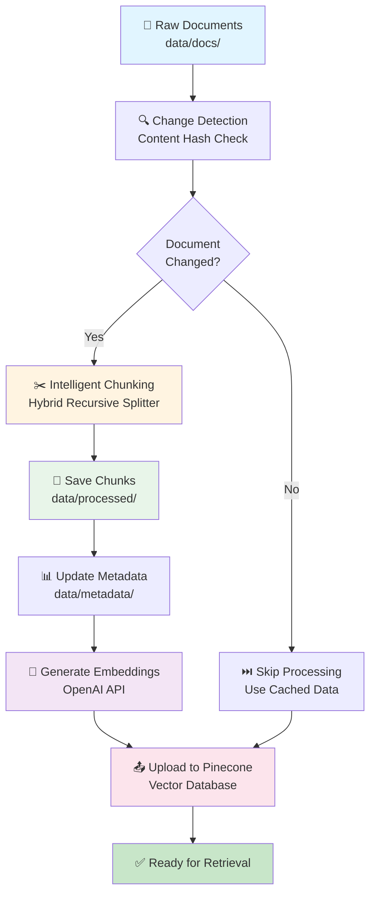
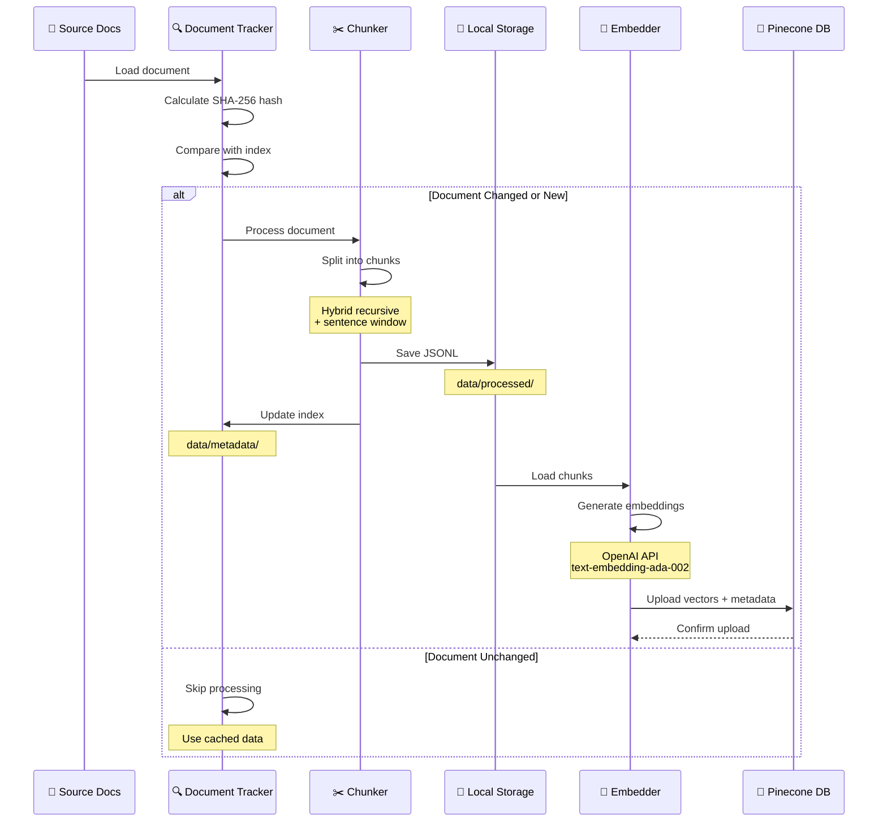
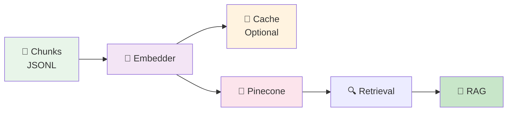
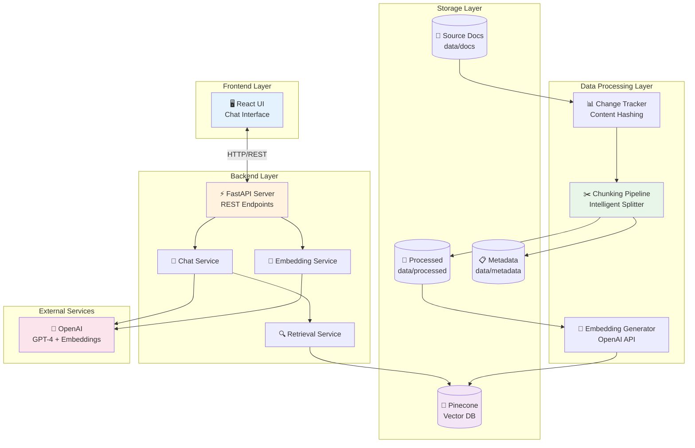
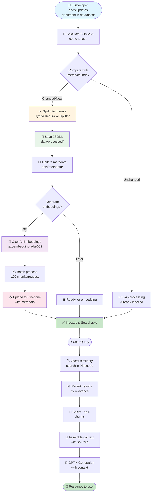
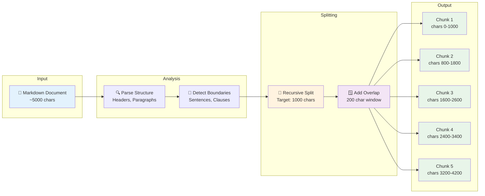

# Knowra Onboarding Agent

AI-powered chatbot that helps onboard new team members by answering project-related questions and providing contextual guidance from documentation, code, and organizational knowledge.

## 📋 Table of Contents

- [Overview](#overview)
- [Features](#features)
- [Project Structure](#project-structure)
- [Getting Started](#getting-started)
- [Architecture](#architecture)
  - [High-Level Architecture](#high-level-architecture)
  - [Document Processing Pipeline](#document-processing-pipeline)
  - [Chunking Process Detail](#chunking-process-detail)
- [Backend](#backend)
- [Frontend](#frontend)
- [Data](#data)
- [Pipelines](#pipelines)
- [📖 Chunking Pipeline Deep Dive](#-chunking-pipeline-deep-dive) ⭐ **Collapsible detailed guide**
- [Configuration](#configuration)
- [Scripts](#scripts)
- [Notebooks](#notebooks)
- [Development Guide](#development-guide)
- [Deployment](#deployment)
- [Documentation](#documentation)
- [Contributing](#contributing)
- [License](#license)

## 🎯 Overview

The Knowra Onboarding Agent is an intelligent RAG (Retrieval-Augmented Generation) system designed to accelerate employee onboarding by providing instant, contextual answers to questions about:

- Company policies and procedures
- System architecture and technical documentation
- Business processes and workflows
- Security and compliance requirements
- API references and code examples

### Key Technologies

- **Backend**: FastAPI (Python)
- **Frontend**: React + Vite (TypeScript)
- **Vector Database**: Pinecone
- **LLM**: OpenAI GPT-4
- **Embeddings**: OpenAI text-embedding-ada-002
- **Containerization**: Docker

## ✨ Features

- 🤖 **Conversational AI**: Natural language Q&A interface
- 📚 **Knowledge Base**: Ingests and indexes documentation, policies, and guides
- 🔍 **Semantic Search**: Finds relevant information using vector embeddings
- 🎯 **Context-Aware**: Retrieves and ranks relevant chunks for accurate responses
- 🔐 **Secure**: Implements security best practices and compliance measures
- 📊 **Analytics**: Track usage and improve responses over time
- 🌐 **Multi-Format Support**: Markdown, PDF, text documents

## 📁 Project Structure

```
knowra-onboarding-agent/
│
├── backend/                     # FastAPI backend service
├── frontend/                    # React frontend application
├── data/                        # Knowledge base and processed data
├── docs/                        # Project documentation
├── pipelines/                   # Data processing pipelines
├── configs/                     # Configuration files
├── scripts/                     # Automation scripts
├── notebooks/                   # Jupyter notebooks for experiments
├── docker-compose.yml           # Container orchestration
├── Dockerfile                   # Backend Docker image
└── README.md                    # This file
```

---

## 🔧 Backend (`/backend`)

FastAPI-based REST API that handles chat requests, document ingestion, and orchestrates the RAG pipeline.

### Structure

```
backend/
├── app/
│   ├── api/                     # API route definitions
│   ├── core/                    # Core configuration & DI
│   ├── services/                # Business logic
│   ├── models/                  # Pydantic schemas
│   ├── utils/                   # Helper utilities
│   └── main.py                  # Application entry point
├── tests/                       # Unit & integration tests
└── requirements.txt             # Python dependencies
```

### Key Components

**[TO BE FILLED BY BACKEND TEAM]**

#### API Endpoints

| Endpoint | Method | Description |
|----------|--------|-------------|
| `/` | GET | Health check |
| `/api/chat` | POST | Send message to chatbot |
| `/api/ingest` | POST | Ingest new documents |
| `/api/search` | GET | Search knowledge base |

#### Services

- **Chat Service**: Handles conversation logic and response generation
- **Embedding Service**: Generates vector embeddings for text
- **Retrieval Service**: Queries Pinecone and ranks results
- **RAG Service**: Orchestrates retrieval and generation

#### Setup & Run

```bash
cd backend
pip install -r requirements.txt
uvicorn app.main:app --reload --host 0.0.0.0 --port 8000
```

### Testing

```bash
pytest tests/ -v
```

---

## 🎨 Frontend (`/frontend`)

React-based user interface built with Vite and TypeScript, providing an intuitive chat experience.

### Structure

```
frontend/
├── src/
│   ├── components/              # Reusable UI components
│   ├── pages/                   # Page-level components
│   ├── hooks/                   # Custom React hooks
│   ├── services/                # API communication
│   ├── store/                   # State management
│   ├── utils/                   # Helper functions
│   └── index.tsx                # Application entry
└── package.json                 # Node dependencies
```

### Key Components

**[TO BE FILLED BY FRONTEND TEAM]**

#### Components

- **ChatBox**: Main chat interface component
- **MessageList**: Displays conversation history
- **InputBar**: User input with submit functionality
- **Sidebar**: Navigation and settings
- **LoadingIndicator**: Shows processing state

#### State Management

- **Chat Store**: Manages conversation state
- **User Store**: User preferences and settings
- **App Store**: Global application state

#### Setup & Run

```bash
cd frontend
npm install
npm run dev
```

The application will be available at `http://localhost:5173`

### Build for Production

```bash
npm run build
```

---

## 📊 Data (`/data`)

Storage and organization of knowledge base content and processed data.

### Structure

```
data/
├── docs/                        # Source documentation (Markdown, PDF, etc.)
├── processed/                   # Chunked and cleaned text
├── embeddings/                  # Local embedding cache
└── metadata/                    # Document metadata (JSON)
```

### Data Flow

The data processing pipeline transforms raw documents into searchable vector embeddings through four main stages:



#### Stage 1: Document Ingestion & Change Detection

Raw documents are monitored for changes using SHA-256 content hashing:

- **New documents**: Processed immediately
- **Modified documents**: Re-chunked and re-indexed
- **Unchanged documents**: Skipped (efficiency optimization)

Tracking data stored in: `data/metadata/metadata_index.json`

#### Stage 2: Intelligent Chunking

Documents are split into optimal chunks using a **Hybrid Recursive Splitter** with:

- **Markdown-aware splitting**: Respects headers, paragraphs, lists
- **Sentence boundary detection**: Maintains semantic coherence
- **Sliding window overlap**: Preserves context across chunks (200 chars default)
- **Configurable sizes**: 1000 chars default, 50 chars minimum

Output format: JSONL (JSON Lines) in `data/processed/`

#### Stage 3: Embedding Generation

Chunks are converted to 1536-dimension vectors using:

- **Model**: OpenAI `text-embedding-ada-002`
- **Batch processing**: 100 chunks per API request
- **Rate limiting**: Automatic retry with exponential backoff
- **Local caching**: Optional embedding storage in `data/embeddings/`

#### Stage 4: Vector Database Upload

Embeddings are uploaded to Pinecone with rich metadata:

- **Namespace organization**: `knowledge_base` (default)
- **Document versioning**: Track updates via timestamps
- **Metadata preservation**: Source, title, chunk context included

#### Document Format Requirements

- **Markdown files** (.md) - Preferred format
- **Plain text files** (.txt)
- **PDF documents** (.pdf) - Planned support
- **Encoding**: UTF-8 required

#### Output Metadata Schema

Each processed chunk includes comprehensive metadata:

```json
{
  "chunk_id": "doc_a3f5e8b2_chunk_0000",
  "doc_id": "doc_a3f5e8b2_c1d4_9f2b_7e6a_4b8c",
  "content": "The actual chunk text content...",
  "metadata": {
    "doc_id": "doc_a3f5e8b2_c1d4_9f2b_7e6a_4b8c",
    "source": "data/docs/01_ONBOARDING_GUIDE.md",
    "page": null,
    "timestamp": "2025-10-27T12:00:00.000000",
    "chunk_index": 0,
    "total_chunks": 5,
    "char_count": 1000,
    "word_count": 150,
    "title": "Onboarding Guide",
    "file_name": "01_ONBOARDING_GUIDE.md"
  }
}
```

---

## 🔄 Pipelines (`/pipelines`)

Data processing pipelines for ingestion, chunking, embedding, and retrieval.

### Structure

```text
pipelines/
├── chunking/
│   ├── intelligent_chunking_pipeline.py  # Main chunking orchestrator
│   ├── hybrid_recursive_splitter.py      # Smart text splitter
│   ├── document_tracker.py               # Change detection
│   ├── pinecone_synchronizer.py          # Vector DB sync
│   └── __init__.py
├── embedding/
│   ├── embedder_pinecone.py              # Embedding generation
│   └── __init__.py
├── ingestion_pipeline.py                 # End-to-end ingestion
├── retriever_pipeline.py                 # Retrieval & reranking
└── utils/                                # Shared utilities
```

### Pipeline Overview

The data processing pipeline consists of three main stages that work together to transform raw documents into searchable knowledge:



### 1. Chunking Strategy

**Hybrid Recursive + Sentence Window Approach**

The intelligent chunking pipeline uses a sophisticated two-stage approach:

#### Stage 1: Change Detection

```python
# Automatic change detection via content hashing
from pipelines.chunking.document_tracker import DocumentTracker

tracker = DocumentTracker(index_file="data/metadata/metadata_index.json")
doc_id, needs_processing, old_metadata = tracker.check_document(
    source="data/docs/guide.md",
    content=document_content
)

# Only processes if content changed
if needs_processing:
    # Proceed to chunking...
```

Benefits:
- 🚀 **Fast**: Skip unchanged documents
- 💰 **Cost-effective**: Avoid redundant embedding API calls
- 📊 **Trackable**: Full audit trail of changes

#### Stage 2: Intelligent Chunking

```python
from pipelines.chunking.intelligent_chunking_pipeline import IntelligentChunkingPipeline

# Initialize pipeline
pipeline = IntelligentChunkingPipeline(
    chunk_size=1000,              # Maximum chunk size
    chunk_overlap=200,            # Overlap for context preservation
    min_chunk_size=50,            # Avoid tiny fragments
    output_dir="data/processed",  # Where to save chunks
    is_markdown=True              # Enable markdown-aware splitting
)

# Process all documents
results = pipeline.process_directory(
    docs_dir="data/docs",
    pattern="*.md"
)
```

**Chunking Parameters:**

| Parameter | Default | Description | Tuning Guidance |
|-----------|---------|-------------|-----------------|
| `chunk_size` | 1000 | Maximum characters per chunk | Increase for more context, decrease for precision |
| `chunk_overlap` | 200 | Characters shared between chunks | 15-25% of chunk_size recommended |
| `min_chunk_size` | 50 | Minimum chunk size to keep | Prevents meaningless fragments |
| `is_markdown` | True | Respect markdown structure | Enable for .md files |

**Splitting Hierarchy:**

1. **Markdown Headers** (`## `, `### `) - Primary boundaries
2. **Paragraphs** (`\n\n`) - Natural breaks
3. **Sentences** (`. `, `! `, `? `) - Semantic units
4. **Clauses** (`, `, `; `) - Fallback boundaries
5. **Words** (` `) - Last resort

Implementation: `pipelines/chunking/hybrid_recursive_splitter.py`

### 2. Embedding Process

**Vector Generation with OpenAI**

Chunks are converted to dense vector representations that capture semantic meaning:

```python
from pipelines.embedding.embedder_pinecone import EmbedderPinecone

# Initialize embedder
embedder = EmbedderPinecone(
    model="text-embedding-ada-002",
    dimension=1536,
    batch_size=100
)

# Generate embeddings for chunks
embeddings = embedder.embed_chunks(chunks)
```

**Process Details:**

- **Model**: `text-embedding-ada-002` (OpenAI)
- **Dimensions**: 1536-dimensional vectors
- **Batch Size**: 100 chunks per API request (rate limit optimization)
- **Rate Limiting**: Automatic exponential backoff on 429 errors
- **Cost**: ~$0.0001 per 1K tokens (~750 words)

**Caching Strategy:**

```text
data/embeddings/
├── doc_uuid_001.npy         # NumPy array of embeddings
├── doc_uuid_002.npy
└── embedding_index.json     # Mapping of doc_id to embedding file
```

Local caching prevents redundant API calls when re-syncing to Pinecone.

Implementation: `pipelines/embedding/embedder_pinecone.py`

### 3. Retrieval & Reranking

**Multi-Stage Retrieval Pipeline**

When a user asks a question, the system retrieves relevant context through multiple stages:


**Stage Breakdown:**

1. **Initial Retrieval**: Top-K vector similarity search (K=20)
   - Cosine similarity in Pinecone
   - Fast approximate nearest neighbor search

2. **Reranking**: Context relevance scoring
   - Cross-encoder models (optional)
   - Metadata-based boosting (recency, source priority)
   - Diversity filtering (avoid redundant chunks)

3. **Final Selection**: Top-5 most relevant chunks
   - Balance relevance vs. diversity
   - Maintain context coherence

4. **Context Assembly**: Combine chunks with metadata
   - Include source citations
   - Preserve document structure
   - Format for LLM consumption

Implementation: `pipelines/retriever_pipeline.py`

### Running Pipelines

#### Quick Start: Process All Documents

```bash
# Run from pipelines/chunking directory
cd pipelines/chunking
python intelligent_chunking_pipeline.py
```

This will:
- ✅ Scan `data/docs/` for markdown files
- 🔍 Detect changes using content hashing
- ✂️ Chunk modified/new documents
- 💾 Save JSONL to `data/processed/`
- 📊 Update metadata index

#### Advanced: Custom Configuration

```python
from pipelines.chunking.intelligent_chunking_pipeline import IntelligentChunkingPipeline

pipeline = IntelligentChunkingPipeline(
    chunk_size=1500,                    # Larger chunks
    chunk_overlap=300,                  # More overlap
    min_chunk_size=100,                 # Higher minimum
    index_file="data/metadata/metadata_index.json",
    output_dir="data/processed",
    namespace="custom_namespace",       # Pinecone namespace
    is_markdown=True,
    dry_run=False                       # Enable Pinecone sync
)

# Process with Pinecone sync
results = pipeline.process_directory(
    docs_dir="data/docs",
    pattern="*.md",
    sync_to_pinecone=True              # Upload to Pinecone
)

# View statistics
pipeline.print_statistics()
```

#### Processing Output Example

```text
======================================================================
🚀 INTELLIGENT CHUNKING PIPELINE
======================================================================
📁 Processing directory: data/docs
🔍 Pattern: *.md
📄 Found 9 files
⚙️  Chunk size: 1000, Overlap: 200
🎯 Pinecone namespace: knowledge_base
======================================================================
➕ NEW document: 01_ONBOARDING_GUIDE.md
   ✂️  Split into 12 chunks
   💾 Saved to: doc_a3f5e8b2_chunks.jsonl
⏭️  SKIPPED (unchanged): 02_BUSINESS_OVERVIEW.md
🔄 UPDATED document: 03_SYSTEM_ARCHITECTURE.md
   ✂️  Split into 8 chunks
   💾 Saved to: doc_b4c6d7e9_chunks.jsonl
======================================================================
📊 PROCESSING STATISTICS
======================================================================
✅ Processed:     2 documents
   ➕ New:        1
   🔄 Updated:    1
⏭️  Skipped:      7 (unchanged)
❌ Errors:        0
📝 Total chunks:  20
======================================================================
```

### Integration with Embedding Pipeline

**Future workflow** (after embedding implementation):

```python
# Step 1: Chunk documents (already implemented)
from pipelines.chunking.intelligent_chunking_pipeline import IntelligentChunkingPipeline

chunking_pipeline = IntelligentChunkingPipeline()
chunk_results = chunking_pipeline.process_directory("data/docs")

# Step 2: Generate embeddings (to be implemented)
from pipelines.embedding.embedder_pinecone import EmbedderPinecone

embedder = EmbedderPinecone(model="text-embedding-ada-002")

for doc_path, chunks in chunk_results.items():
    # Generate embeddings for all chunks
    embeddings = embedder.embed_chunks(chunks)
    
    # Save embeddings locally (optional)
    embedder.cache_embeddings(chunks, embeddings, "data/embeddings")
    
    # Upload to Pinecone
    embedder.upload_to_pinecone(
        chunks=chunks,
        embeddings=embeddings,
        namespace="knowledge_base"
    )

print(f"✅ Processed {len(chunk_results)} documents")
```

### Performance Optimization

**Tips for efficient processing:**

1. **Use Change Detection**: Only re-process modified documents
   - Tracked automatically via `data/metadata/metadata_index.json`

2. **Optimize Chunk Size**: Balance retrieval precision vs. context
   - Small chunks (300-500): Better precision, more API calls
   - Large chunks (1500-2000): More context, less precision
   - Recommended: 800-1200 characters

3. **Batch Embeddings**: Process multiple chunks per API request
   - Default batch size: 100 chunks
   - Reduces API overhead by ~95%

4. **Cache Locally**: Store embeddings before Pinecone upload
   - Enables re-sync without re-generating embeddings
   - Saves on OpenAI API costs

5. **Parallel Processing**: Process multiple documents concurrently
   - Safe for chunking (I/O bound)
   - Rate-limit aware for embeddings (API bound)

---

## 📖 Chunking Pipeline Deep Dive

> **💡 Tip:** The sections below are collapsible! Click on any section header to expand and view detailed information. This keeps the README organized while providing comprehensive documentation when you need it.

<details>
<summary><strong>🚀 Quick Start Guide</strong> - Get started in 2 minutes (click to expand)</summary>

### Quick Commands

```bash
# Process all documents
cd pipelines/chunking
python intelligent_chunking_pipeline.py

# View processed chunks (PowerShell)
Get-Content data\processed\*.jsonl | Select-Object -First 1 | ConvertFrom-Json | ConvertTo-Json

# Count total chunks
(Get-Content data\processed\*.jsonl).Count

# Force re-processing (delete index)
Remove-Item data\metadata\metadata_index.json
```

### Basic Python Usage

```python
from pipelines.chunking.intelligent_chunking_pipeline import IntelligentChunkingPipeline

# Default configuration
pipeline = IntelligentChunkingPipeline()
results = pipeline.process_directory("data/docs")
pipeline.print_statistics()

# Custom configuration
pipeline = IntelligentChunkingPipeline(
    chunk_size=1500,
    chunk_overlap=300,
    output_dir="data/processed"
)
results = pipeline.process_directory("data/docs", pattern="*.md")
```

### Expected Output

```text
======================================================================
🚀 INTELLIGENT CHUNKING PIPELINE
======================================================================
📁 Processing directory: data/docs
📄 Found 9 files
⚙️  Chunk size: 1000, Overlap: 200
======================================================================
➕ NEW document: 01_GUIDE.md → 12 chunks
⏭️  SKIPPED (unchanged): 02_OVERVIEW.md
🔄 UPDATED document: 03_ARCHITECTURE.md → 8 chunks
======================================================================
📊 PROCESSING STATISTICS
✅ Processed:     2 documents
⏭️  Skipped:      7 (unchanged)
📝 Total chunks:  20
======================================================================
```

</details>

<details>
<summary><strong>🔍 How It Works</strong> - Understanding the chunking process (click to expand)</summary>

### Step-by-Step Process

#### 1. Document Loading & Hashing

The system calculates a SHA-256 hash of each document's content:

```python
import hashlib
content_hash = hashlib.sha256(content.encode('utf-8')).hexdigest()
```

This hash is compared with the stored hash in `data/metadata/metadata_index.json`. If they match, processing is skipped.

#### 2. Markdown Structure Analysis

The splitter identifies document structure:

- **Headers**: `#`, `##`, `###`
- **Paragraphs**: Double newline `\n\n`
- **Lists**: Bullet and numbered
- **Code blocks**: Triple backticks
- **Sentences**: Period, exclamation, question marks

#### 3. Recursive Splitting

Documents are split using a hierarchy:

```text
Level 1: Headers (## Section, ### Subsection)
    ↓
Level 2: Paragraphs (\n\n)
    ↓
Level 3: Sentences (. ! ?)
    ↓
Level 4: Clauses (, ;)
    ↓
Level 5: Words (spaces)
```

Each level is tried until chunks are within target size (default: 1000 chars).

#### 4. Overlapping Windows

Adjacent chunks share content (default: 200 chars) to maintain context:

```text
Document: [AAAAAABBBBBBBCCCCCCCDDDDDDD]
                                  
Chunk 1:  [AAAAAABBBBBBB]
Chunk 2:          [BBBBBBBCCCCCC]
Chunk 3:                 [CCCCCCDDDDDDD]
                    ↑
                  Overlap
```

**Why overlap?**
- Prevents information loss at boundaries
- Maintains context for retrieval
- Improves semantic coherence

#### 5. Metadata Enrichment

Each chunk receives comprehensive metadata:

```json
{
  "chunk_id": "doc_uuid_chunk_0001",
  "doc_id": "doc_uuid",
  "content": "The actual text content...",
  "metadata": {
    "source": "data/docs/guide.md",
    "timestamp": "2025-10-27T12:00:00",
    "chunk_index": 1,
    "total_chunks": 5,
    "char_count": 987,
    "word_count": 145,
    "title": "Guide Title",
    "file_name": "guide.md"
  }
}
```

#### 6. JSONL Storage

Chunks are saved as JSONL (JSON Lines) - one JSON object per line:

```text
data/processed/doc_uuid_chunks.jsonl
├── Line 1: {chunk 1 JSON}
├── Line 2: {chunk 2 JSON}
├── Line 3: {chunk 3 JSON}
└── Line 4: {chunk 4 JSON}
```

This format enables efficient streaming and batch processing.

</details>

<details>
<summary><strong>⚙️ Configuration & Tuning</strong> - Optimize for your use case (click to expand)</summary>

### Configuration Parameters

```python
IntelligentChunkingPipeline(
    # Chunking parameters
    chunk_size=1000,              # Maximum chunk size (chars)
    chunk_overlap=200,            # Overlap between chunks (chars)
    min_chunk_size=50,            # Minimum viable chunk (chars)
    
    # Processing parameters
    is_markdown=True,             # Enable markdown parsing
    
    # I/O parameters
    index_file="data/metadata/metadata_index.json",
    output_dir="data/processed",
    
    # Pinecone parameters (future)
    namespace="knowledge_base",
    dry_run=True                  # Simulate Pinecone operations
)
```

### Tuning Guidelines

#### For Q&A Systems

```python
# Smaller chunks = precise retrieval
pipeline = IntelligentChunkingPipeline(
    chunk_size=800,
    chunk_overlap=160  # 20% overlap
)
```

**Best for:**
- Direct question answering
- Fact extraction
- Specific information lookup

**Trade-offs:**
- ✅ Higher precision
- ✅ Better relevance
- ❌ Less context per chunk
- ❌ More API calls

#### For Summarization

```python
# Larger chunks = more context
pipeline = IntelligentChunkingPipeline(
    chunk_size=1500,
    chunk_overlap=300  # 20% overlap
)
```

**Best for:**
- Document summarization
- Context-heavy queries
- Broad topic understanding

**Trade-offs:**
- ✅ Richer context
- ✅ Fewer chunks
- ❌ Lower precision
- ❌ More noise

#### Overlap Recommendations

| Overlap % | Use Case | Benefits |
|-----------|----------|----------|
| 15-20% | Fast processing | Minimal redundancy |
| 20-25% | Balanced (recommended) | Good context + efficiency |
| 25-30% | Maximum context | Best continuity |

**Formula:** `overlap = chunk_size × 0.20` (for 20%)

### Chunk Size Selection

| Size | Characters | Words | Use Case |
|------|-----------|-------|----------|
| Small | 300-500 | 50-75 | Precise Q&A |
| Medium | 800-1200 | 120-180 | Balanced (recommended) |
| Large | 1500-2000 | 225-300 | Summarization |

**Default: 1000 characters** (~150 words, ~250 tokens)

</details>

<details>
<summary><strong>📤 Output Format</strong> - Understanding the generated data (click to expand)</summary>

### Directory Structure

After processing:

```text
data/
├── docs/                          # Source documents
│   ├── 01_GUIDE.md
│   ├── 02_OVERVIEW.md
│   └── 03_ARCHITECTURE.md
│
├── processed/                     # Chunked output
│   ├── doc_a3f5_chunks.jsonl     # 12 chunks from GUIDE
│   ├── doc_b4c6_chunks.jsonl     # 8 chunks from OVERVIEW
│   └── doc_c7d8_chunks.jsonl     # 15 chunks from ARCHITECTURE
│
└── metadata/                      # Tracking
    └── metadata_index.json        # Document hashes & stats
```

### JSONL File Format

**Filename:** `{doc_id}_chunks.jsonl`

**Content:** One JSON object per line (newline-delimited JSON)

```jsonl
{"chunk_id":"doc_001_chunk_0000","doc_id":"doc_001","content":"First chunk...","metadata":{...}}
{"chunk_id":"doc_001_chunk_0001","doc_id":"doc_001","content":"Second chunk...","metadata":{...}}
{"chunk_id":"doc_001_chunk_0002","doc_id":"doc_001","content":"Third chunk...","metadata":{...}}
```

### Complete Chunk Schema

```json
{
  "chunk_id": "string - Unique chunk identifier (doc_id + index)",
  "doc_id": "string - Parent document UUID",
  "content": "string - The actual text content of the chunk",
  "metadata": {
    "doc_id": "string - Parent document ID (duplicate for convenience)",
    "source": "string - Full file path to source document",
    "page": "number|null - Page number (for PDFs, null for markdown)",
    "timestamp": "string - ISO 8601 processing timestamp",
    "chunk_index": "number - Zero-based position in document",
    "total_chunks": "number - Total chunks in parent document",
    "char_count": "number - Character count in this chunk",
    "word_count": "number - Word count in this chunk",
    "title": "string|null - Document title (from first H1 header)",
    "file_name": "string - Source filename"
  }
}
```

### Metadata Index Format

**Location:** `data/metadata/metadata_index.json`

**Purpose:** Track document state for change detection

```json
{
  "doc_a3f5e8b2_c1d4": {
    "doc_id": "doc_a3f5e8b2_c1d4",
    "source": "data/docs/01_GUIDE.md",
    "content_hash": "a3f5e8b2c1d4f7a9b2e5c8d1...",
    "page": null,
    "chunk_count": 12,
    "created_at": "2025-10-27T10:00:00",
    "updated_at": "2025-10-27T12:00:00",
    "last_processed": "2025-10-27T12:00:00",
    "title": "Onboarding Guide",
    "file_name": "01_GUIDE.md"
  }
}
```

### Reading Processed Data

#### Load All Chunks from a File

```python
import json

with open("data/processed/doc_uuid_chunks.jsonl") as f:
    chunks = [json.loads(line) for line in f]

print(f"Loaded {len(chunks)} chunks")
```

#### Stream Large Files

```python
# Memory-efficient streaming
with open("data/processed/doc_uuid_chunks.jsonl") as f:
    for line in f:
        chunk = json.loads(line)
        # Process chunk...
```

#### PowerShell Examples

```powershell
# View first chunk (formatted)
Get-Content data\processed\*.jsonl -First 1 | ConvertFrom-Json | ConvertTo-Json

# Count chunks per file
Get-ChildItem data\processed\*.jsonl | ForEach-Object {
    $count = (Get-Content $_.FullName).Count
    Write-Host "$($_.Name): $count chunks"
}

# Search chunk content
Get-Content data\processed\*.jsonl | ConvertFrom-Json | Where-Object {
    $_.content -like "*API*"
}
```

</details>

<details>
<summary><strong>🔄 Change Detection</strong> - How incremental updates work (click to expand)</summary>

### Overview

The system uses **SHA-256 content hashing** to detect document changes, enabling efficient incremental processing.

### How It Works

```python
# 1. Load document
with open('data/docs/guide.md', 'r') as f:
    content = f.read()

# 2. Calculate hash
import hashlib
content_hash = hashlib.sha256(content.encode('utf-8')).hexdigest()

# 3. Compare with stored hash
stored_hash = metadata_index[doc_id]['content_hash']

# 4. Decide action
if content_hash != stored_hash:
    # Document changed - re-process
    process_document()
else:
    # Document unchanged - skip
    skip_processing()
```

### Document States

| State | Indicator | Action |
|-------|-----------|--------|
| **New** | No hash in index | ➕ Process immediately |
| **Modified** | Hash changed | 🔄 Re-chunk and update |
| **Unchanged** | Hash matches | ⏭️ Skip processing |

### Benefits

#### 1. Speed (⚡)

```text
First run:  Process 100 documents → 10 minutes
Second run: Process 2 changed docs → 30 seconds (95% faster!)
```

#### 2. Cost Savings (💰)

```text
Without change detection:
- Re-chunk all 100 documents
- Generate 500 embeddings
- Cost: $0.05 per run

With change detection:
- Re-chunk 2 documents
- Generate 10 embeddings
- Cost: $0.001 per run (98% savings!)
```

#### 3. Traceability (📊)

```json
{
  "doc_id": "...",
  "created_at": "2025-10-27T10:00:00",
  "updated_at": "2025-10-27T15:30:00",
  "last_processed": "2025-10-27T15:30:00"
}
```

Know exactly when documents were added, modified, and processed.

### Common Scenarios

#### Scenario 1: Initial Processing

```bash
$ cd pipelines/chunking
$ python intelligent_chunking_pipeline.py

Output:
➕ NEW document: 01_GUIDE.md → 12 chunks
➕ NEW document: 02_OVERVIEW.md → 8 chunks
➕ NEW document: 03_ARCHITECTURE.md → 15 chunks
✅ Processed: 3 documents, Total chunks: 35
```

#### Scenario 2: No Changes

```bash
$ python intelligent_chunking_pipeline.py

Output:
⏭️  SKIPPED (unchanged): 01_GUIDE.md
⏭️  SKIPPED (unchanged): 02_OVERVIEW.md
⏭️  SKIPPED (unchanged): 03_ARCHITECTURE.md
✅ Processed: 0 documents, Skipped: 3
```

#### Scenario 3: Selective Update

```bash
# Edit 02_OVERVIEW.md
$ python intelligent_chunking_pipeline.py

Output:
⏭️  SKIPPED (unchanged): 01_GUIDE.md
🔄 UPDATED document: 02_OVERVIEW.md → 10 chunks (was 8)
⏭️  SKIPPED (unchanged): 03_ARCHITECTURE.md
✅ Processed: 1 document, Skipped: 2
```

#### Scenario 4: Force Re-processing

```bash
# Delete metadata index
$ Remove-Item data\metadata\metadata_index.json
$ python intelligent_chunking_pipeline.py

Output:
➕ NEW document: 01_GUIDE.md → 12 chunks
➕ NEW document: 02_OVERVIEW.md → 10 chunks
➕ NEW document: 03_ARCHITECTURE.md → 15 chunks
✅ All documents treated as NEW
```

### Maintenance

#### View Change History

```python
import json

with open("data/metadata/metadata_index.json") as f:
    index = json.load(f)

for doc_id, meta in index.items():
    print(f"{meta['file_name']}:")
    print(f"  Created: {meta['created_at']}")
    print(f"  Updated: {meta['updated_at']}")
    print(f"  Chunks: {meta['chunk_count']}")
    print()
```

#### Backup Metadata

```bash
# Regular backups recommended
Copy-Item data\metadata\metadata_index.json data\metadata\backup\index_$(Get-Date -Format 'yyyy-MM-dd').json
```

#### Reset Processing State

```bash
# Force re-process everything
Remove-Item data\metadata\metadata_index.json
Remove-Item data\processed\*.jsonl
```

</details>

<details>
<summary><strong>🔗 Integration with Embeddings</strong> - Next steps after chunking (click to expand)</summary>

### Current State

```text
✅ Working Now:
Documents → Chunking → JSONL Output

Output: data/processed/*.jsonl
```

### Future Integration

```text
🔜 Complete Pipeline:
Documents → Chunking → JSONL → Embeddings → Pinecone → Retrieval

Integration points ready:
✅ JSONL format (standard)
✅ Metadata structure (complete)
✅ Change detection (efficient)
✅ Batch processing (API-friendly)
```

### Integration Workflow

```python
# Step 1: Chunk documents (✅ Already implemented)
from pipelines.chunking.intelligent_chunking_pipeline import IntelligentChunkingPipeline

pipeline = IntelligentChunkingPipeline()
chunk_results = pipeline.process_directory("data/docs")

# Step 2: Generate embeddings (🔜 To be implemented)
from pipelines.embedding.embedder_pinecone import EmbedderPinecone

embedder = EmbedderPinecone(model="text-embedding-ada-002")

for doc_path, chunks in chunk_results.items():
    # Generate embeddings
    embeddings = embedder.embed_chunks(chunks)
    
    # Save embeddings locally (optional cache)
    embedder.cache_embeddings(chunks, embeddings, "data/embeddings")
    
    # Upload to Pinecone
    embedder.upload_to_pinecone(
        chunks=chunks,
        embeddings=embeddings,
        namespace="knowledge_base"
    )

print(f"✅ Processed {len(chunk_results)} documents")
```

### Data Flow



### Why This Architecture?

#### 1. **Separation of Concerns**

- Chunking is independent
- Can update chunking strategy without re-embedding
- Can test different embedding models without re-chunking

#### 2. **Efficiency**

```python
# Only re-embed changed documents
if doc_changed:
    chunks = chunk_document(doc)
    embeddings = embed_chunks(chunks)
else:
    embeddings = load_cached_embeddings(doc_id)
```

#### 3. **Cost Optimization**

```text
Scenario: Update 1 of 100 documents

Without separation:
- Re-chunk 100 docs (fast, local)
- Re-embed 100 docs (slow, costly)
- Total cost: $0.05

With separation:
- Re-chunk 1 doc (fast, local)
- Re-embed 1 doc (fast, cheap)
- Total cost: $0.0005 (100x cheaper!)
```

#### 4. **Flexibility**

Can switch embedding providers without changing chunking:

```python
# OpenAI
embedder = OpenAIEmbedder(model="text-embedding-ada-002")

# Or Cohere
embedder = CohereEmbedder(model="embed-english-v3.0")

# Or Sentence Transformers (local)
embedder = LocalEmbedder(model="all-MiniLM-L6-v2")
```

### Ready for Integration

The chunking pipeline provides everything needed:

✅ **Standard format**: JSONL is universally supported  
✅ **Complete metadata**: All fields embedding systems need  
✅ **Batch-friendly**: Process 100+ chunks per request  
✅ **Change detection**: Only embed what changed  
✅ **Error recovery**: Can restart from any chunk

### Next Steps

1. **Implement embedding generation** (`pipelines/embedding/`)
2. **Set up Pinecone index** (dimension: 1536)
3. **Create upload script** with batch processing
4. **Add retrieval pipeline** for semantic search
5. **Connect to chat interface** for end-to-end RAG

</details>

<details>
<summary><strong>❓ Troubleshooting</strong> - Common issues and solutions (click to expand)</summary>

### Issue: All Documents Skipped

**Symptom:**
```text
⏭️  SKIPPED (unchanged): 01_GUIDE.md
⏭️  SKIPPED (unchanged): 02_OVERVIEW.md
📊 Processed: 0 documents
```

**Cause:** No documents have changed since last run.

**Solution:** This is normal! Change detection is working. To force re-processing:

```bash
# Option 1: Delete metadata index
Remove-Item data\metadata\metadata_index.json

# Option 2: Delete specific processed files
Remove-Item data\processed\*.jsonl

# Option 3: Modify source document
# Edit any file in data/docs/

# Then re-run
cd pipelines\chunking
python intelligent_chunking_pipeline.py
```

---

### Issue: Import Errors

**Symptom:**
```text
ModuleNotFoundError: No module named 'langchain'
```

**Solution:** Install required dependencies:

```bash
pip install langchain langchain-text-splitters langchain-core
```

Full requirements:
```bash
pip install langchain langchain-text-splitters langchain-core pinecone-client openai
```

---

### Issue: Empty or Tiny Chunks

**Symptom:** Chunks have very little content or are empty.

**Cause:** `min_chunk_size` is too low or documents have unusual structure.

**Solution:** Increase minimum chunk size:

```python
pipeline = IntelligentChunkingPipeline(
    min_chunk_size=100  # Increase from default 50
)
```

---

### Issue: Too Many Chunks

**Symptom:** Documents split into 100+ tiny chunks.

**Cause:** `chunk_size` is too small for your documents.

**Solution:** Increase chunk size:

```python
pipeline = IntelligentChunkingPipeline(
    chunk_size=2000,     # Increase from default 1000
    chunk_overlap=400    # Adjust overlap proportionally
)
```

---

### Issue: Lost Context at Boundaries

**Symptom:** Chunks seem disconnected, missing context.

**Cause:** Insufficient overlap between chunks.

**Solution:** Increase overlap:

```python
pipeline = IntelligentChunkingPipeline(
    chunk_size=1000,
    chunk_overlap=300    # Increase from default 200 (30%)
)
```

---

### Issue: Files Not Found

**Symptom:**
```text
FileNotFoundError: [Errno 2] No such file or directory: 'data/docs'
```

**Solution:** Check working directory and paths:

```bash
# Ensure you're in project root
cd d:\learn\knowra-onboarding-agent

# Or provide absolute paths
pipeline = IntelligentChunkingPipeline()
results = pipeline.process_directory(
    "d:/learn/knowra-onboarding-agent/data/docs"
)
```

---

### Issue: Permission Denied

**Symptom:**
```text
PermissionError: [Errno 13] Permission denied: 'data/processed'
```

**Solution:** Check directory permissions:

```bash
# Create directory if missing
New-Item -ItemType Directory -Path data\processed -Force

# Check permissions
Get-Acl data\processed
```

---

### Issue: Unicode Encoding Errors

**Symptom:**
```text
UnicodeDecodeError: 'utf-8' codec can't decode byte...
```

**Solution:** Ensure files are UTF-8 encoded:

```bash
# Convert to UTF-8 (PowerShell)
Get-Content file.md | Set-Content -Encoding UTF8 file_utf8.md
```

Or specify encoding in code:

```python
with open(file_path, 'r', encoding='utf-8', errors='ignore') as f:
    content = f.read()
```

---

### Issue: Out of Memory

**Symptom:** Process crashes with memory error on large documents.

**Solution:** Process documents one at a time:

```python
from pathlib import Path

for file_path in Path("data/docs").glob("*.md"):
    chunks = pipeline.process_document(str(file_path))
    # Process immediately or save
```

---

### Getting Help

If issues persist:

1. **Check logs**: Review error messages carefully
2. **Verify setup**: Ensure all dependencies installed
3. **Test with sample**: Try with a small test file
4. **Check GitHub**: Search for similar issues
5. **Ask for help**: Open an issue with full error trace

</details>

<details>
<summary><strong>✅ Best Practices</strong> - Production-ready recommendations (click to expand)</summary>

### 1. Version Control Strategy

**DO commit:**
```bash
git add data/docs/                  # Source documents
git add data/metadata/              # Tracking index
git add pipelines/                  # Processing code
git add configs/                    # Configuration
```

**DON'T commit:**
```bash
# Add to .gitignore
data/processed/                     # Can be regenerated
data/embeddings/                    # Large binary files
__pycache__/                        # Python cache
*.pyc                              # Compiled Python
.env                               # API keys
```

### 2. Regular Maintenance

#### Daily Tasks
```bash
# Process new/updated documents
cd pipelines/chunking
python intelligent_chunking_pipeline.py
```

#### Weekly Tasks
```bash
# Backup metadata
$date = Get-Date -Format "yyyy-MM-dd"
Copy-Item data\metadata\metadata_index.json data\metadata\backup\index_$date.json

# Clean old processed files (if needed)
# Only if storage is an issue
```

#### Monthly Tasks
```bash
# Full re-processing (verify data integrity)
Remove-Item data\metadata\metadata_index.json
Remove-Item data\processed\*.jsonl
python pipelines\chunking\intelligent_chunking_pipeline.py

# Review chunk quality
# Sample and manually inspect chunks
```

### 3. Quality Assurance

#### Sample Chunk Inspection

```python
import json
import random

# Load random chunks
with open("data/processed/doc_xxx_chunks.jsonl") as f:
    chunks = [json.loads(line) for line in f]

# Sample and review
for _ in range(5):
    sample = random.choice(chunks)
    print(f"\nChunk {sample['chunk_id']}:")
    print(f"Content: {sample['content'][:200]}...")
    print(f"Length: {sample['metadata']['char_count']} chars")
    print(f"Position: {sample['metadata']['chunk_index']}/{sample['metadata']['total_chunks']}")
```

**Look for:**
- ✅ Complete sentences
- ✅ Meaningful content
- ✅ Proper overlap
- ❌ Cut-off sentences
- ❌ Orphaned words
- ❌ Missing context

#### Statistics Monitoring

Always check pipeline output:

```python
pipeline.print_statistics()
```

**Key metrics:**
- **Processed vs Skipped ratio**: High skip rate = efficient
- **Errors**: Should be 0
- **Chunks per document**: 3-15 is typical
- **Average chunk size**: Should be near target

### 4. Performance Optimization

#### Use Change Detection

```python
# DON'T delete metadata unnecessarily
# ❌ Remove-Item data\metadata\metadata_index.json  

# DO let change detection work
# ✅ Only modified docs are re-processed
```

#### Batch Processing

```python
# Process multiple documents efficiently
pipeline = IntelligentChunkingPipeline()
results = pipeline.process_directory(
    "data/docs",
    pattern="*.md"  # Process all at once
)
```

#### Monitor Resource Usage

```python
import time
import psutil

start_time = time.time()
start_memory = psutil.Process().memory_info().rss / 1024 / 1024

# Process documents
pipeline.process_directory("data/docs")

end_time = time.time()
end_memory = psutil.Process().memory_info().rss / 1024 / 1024

print(f"Time: {end_time - start_time:.2f}s")
print(f"Memory: {end_memory - start_memory:.2f}MB")
```

### 5. Testing Strategy

#### Unit Tests

```python
import pytest
from pipelines.chunking.intelligent_chunking_pipeline import IntelligentChunkingPipeline

def test_chunking_basic():
    pipeline = IntelligentChunkingPipeline()
    chunks = pipeline.chunk_document(
        doc_id="test_001",
        content="Test content " * 100,
        source="test.md"
    )
    assert len(chunks) > 0
    assert all(chunk['content'] for chunk in chunks)

def test_change_detection():
    # Test that unchanged docs are skipped
    pass

def test_overlap():
    # Verify chunks have proper overlap
    pass
```

#### Integration Tests

```bash
# Test with sample documents
mkdir data/docs/test
echo "# Test Document" > data/docs/test/sample.md
echo "This is test content." >> data/docs/test/sample.md

python pipelines/chunking/intelligent_chunking_pipeline.py

# Verify output
Test-Path data/processed/doc_*_chunks.jsonl
```

### 6. Error Handling

#### Graceful Degradation

```python
try:
    pipeline = IntelligentChunkingPipeline()
    results = pipeline.process_directory("data/docs")
except Exception as e:
    print(f"Error processing documents: {e}")
    # Log error
    # Send alert
    # Continue with cached data
```

#### Logging

```python
import logging

logging.basicConfig(
    level=logging.INFO,
    format='%(asctime)s - %(levelname)s - %(message)s',
    handlers=[
        logging.FileHandler('chunking.log'),
        logging.StreamHandler()
    ]
)

logger = logging.getLogger(__name__)
logger.info("Starting chunking pipeline...")
```

### 7. Production Checklist

Before deploying to production:

- [ ] Test with sample data
- [ ] Verify all dependencies installed
- [ ] Set up error logging
- [ ] Configure backup schedule
- [ ] Monitor disk space
- [ ] Test change detection
- [ ] Verify chunk quality
- [ ] Document configuration
- [ ] Set up alerts
- [ ] Plan rollback strategy

### 8. Monitoring & Alerts

```python
# Monitor processing metrics
def check_pipeline_health():
    stats = pipeline.get_statistics()
    
    # Alert if error rate high
    if stats['errors'] > stats['processed'] * 0.1:
        send_alert("High error rate in chunking pipeline")
    
    # Alert if no processing for a while
    last_run = get_last_processing_time()
    if (datetime.now() - last_run).days > 7:
        send_alert("Chunking pipeline hasn't run in a week")
```

### 9. Documentation

Keep documentation updated:

```markdown
# Project: Knowra Onboarding Agent
# Last Updated: 2025-10-27
# Chunking Config:
#   - chunk_size: 1000
#   - chunk_overlap: 200
#   - Output: data/processed/
# Processing Schedule: Daily at 2 AM
# Contact: team@example.com
```

### 10. Continuous Improvement

Regularly review and optimize:

- **Monitor retrieval quality**: Are chunks finding relevant info?
- **Analyze chunk sizes**: Distribution and effectiveness
- **Review overlap**: Is 200 chars sufficient?
- **Test alternatives**: Try different chunking strategies
- **Gather feedback**: User satisfaction with results

</details>

---

## ⚙️ Configuration (`/configs`)

Centralized configuration for all application settings.

### Files

```
configs/
├── settings.yaml                # Application settings
├── logging.yaml                 # Logging configuration
└── env.example                  # Environment template
```

### Key Settings

**[TO BE FILLED BY DEVOPS/CONFIG TEAM]**

#### API Configuration

```yaml
api:
  host: "0.0.0.0"
  port: 8000
  cors_origins: ["http://localhost:5173"]
```

#### Pinecone Settings

```yaml
pinecone:
  index_name: "knowra-onboarding"
  dimension: 1536
  metric: "cosine"
  environment: "production"
```

#### LLM Configuration

```yaml
llm:
  model: "gpt-4"
  temperature: 0.7
  max_tokens: 2000
  system_prompt: "You are a helpful onboarding assistant..."
```

### Environment Variables

Copy `.env.example` to `.env` and configure:

```bash
# Required
OPENAI_API_KEY=your_key_here
PINECONE_API_KEY=your_key_here
PINECONE_ENVIRONMENT=your_env_here

# Optional
LOG_LEVEL=INFO
DEBUG=false
```

---

## 🛠️ Scripts (`/scripts`)

Automation scripts for common tasks.

### Available Scripts

**[TO BE FILLED BY DEVOPS TEAM]**

#### `ingest_docs.sh`

Ingests all documents from `data/docs/` into the knowledge base.

```bash
./scripts/ingest_docs.sh
```

#### `run_dev.sh`

Starts both backend and frontend development servers.

```bash
./scripts/run_dev.sh
```

#### `sync_pinecone.py`

Re-synchronizes local embeddings with Pinecone index.

```bash
python scripts/sync_pinecone.py
```

---

## 📓 Notebooks (`/notebooks`)

Jupyter notebooks for experimentation and analysis.

### Available Notebooks

**[TO BE FILLED BY DATA SCIENCE TEAM]**

- `test_chunking.ipynb` - Test and visualize chunking strategies
- `test_semantic_search.ipynb` - Evaluate search relevance
- `rag_experiments.ipynb` - RAG pipeline experiments and tuning

### Running Notebooks

```bash
jupyter notebook notebooks/
```

---

## 🚀 Getting Started

### Prerequisites

- Python 3.11+
- Node.js 18+
- Docker & Docker Compose (optional)
- OpenAI API key
- Pinecone account

### Quick Start

1. **Clone the repository**

```bash
git clone https://github.com/NinobraV/knowra-onboarding-agent.git
cd knowra-onboarding-agent
```

2. **Set up environment variables**

```bash
cp .env.example .env
# Edit .env with your API keys
```

3. **Option A: Run with Docker**

```bash
docker-compose up --build
```

4. **Option B: Run locally**

**Backend:**
```bash
cd backend
pip install -r requirements.txt
uvicorn app.main:app --reload
```

**Frontend:**
```bash
cd frontend
npm install
npm run dev
```

5. **Process documentation (chunking)**

```bash
cd pipelines/chunking
python intelligent_chunking_pipeline.py
```

6. **Access the application** (when deployed)

- Frontend: http://localhost:5173
- Backend API: http://localhost:8000
- API Docs: http://localhost:8000/docs

---

## 🏗️ Architecture

### High-Level Architecture

The system follows a RAG (Retrieval-Augmented Generation) architecture with three main layers:



### Document Processing Pipeline

**Complete flow from raw documents to searchable knowledge:**



### Chunking Process Detail

**How intelligent chunking works:**



**Key Benefits:**

- ✂️ **Context Preservation**: 200-char overlap maintains continuity
- 🎯 **Semantic Coherence**: Respects sentence and paragraph boundaries
- 📊 **Structure Awareness**: Honors markdown headers and lists
- 🔄 **Efficient Updates**: Only re-processes changed documents

### RAG Pipeline

User queries are processed through a multi-stage retrieval and generation pipeline:

1. **User Query** → Received by frontend chat interface
2. **Query Embedding** → Convert query to 1536-dim vector
3. **Vector Search** → Find top-20 similar chunks in Pinecone
4. **Reranking** → Score and select 5 most relevant chunks
5. **Context Assembly** → Combine chunks with source metadata
6. **LLM Generation** → GPT-4 generates response with context
7. **Response** → Return answer with source citations

### Technology Stack

| Component | Technology | Purpose |
|-----------|-----------|---------|
| Backend Framework | FastAPI | REST API server |
| Frontend Framework | React + Vite | User interface |
| Vector Database | Pinecone | Semantic search |
| LLM | OpenAI GPT-4 | Response generation |
| Embeddings | text-embedding-ada-002 | Vector creation (1536-dim) |
| Text Splitting | LangChain | Document chunking |
| State Management | Zustand | Frontend state |
| Containerization | Docker | Deployment |
| Change Detection | SHA-256 Hashing | Incremental updates |

---

## 💻 Development Guide

### Code Style

**Python:**
- Follow PEP 8
- Use type hints
- Maximum line length: 100 characters
- Use Black for formatting

**TypeScript/React:**
- Follow Airbnb style guide
- Use functional components with hooks
- Use TypeScript strict mode
- Use Prettier for formatting

### Git Workflow

1. Create feature branch: `git checkout -b feature/your-feature`
2. Make changes and commit: `git commit -m "feat: description"`
3. Push to GitHub: `git push origin feature/your-feature`
4. Create Pull Request
5. Wait for review and CI/CD checks
6. Merge to main

### Commit Message Convention

```
feat: Add new feature
fix: Fix bug
docs: Update documentation
style: Format code
refactor: Refactor code
test: Add tests
chore: Update dependencies
```

### Testing Guidelines

**[TO BE FILLED BY QA TEAM]**

- Write unit tests for all services
- Maintain >80% code coverage
- Test edge cases and error handling
- Use pytest for Python, Jest for TypeScript

### Performance Considerations

- Cache embeddings locally
- Implement rate limiting
- Optimize chunk size for retrieval
- Monitor API usage and costs

---

## 🚢 Deployment

### Docker Deployment

**[TO BE FILLED BY DEVOPS TEAM]**

```bash
docker-compose up -d
```

### Environment-Specific Configurations

- **Development**: `.env.development`
- **Staging**: `.env.staging`
- **Production**: `.env.production`

### CI/CD Pipeline

- Automated testing on PR
- Build and push Docker images
- Deploy to staging on merge to develop
- Deploy to production on merge to main

---

## 📚 Documentation

### Inline Documentation (Collapsible Sections)

For quick access to chunking pipeline documentation, see the **[📖 Chunking Pipeline Deep Dive](#-chunking-pipeline-deep-dive)** section above with collapsible content covering:

- 🚀 **Quick Start Guide** - Get running in 2 minutes
- 🔍 **How It Works** - Understanding the chunking process
- ⚙️ **Configuration & Tuning** - Optimize for your use case
- 📤 **Output Format** - Understanding generated data
- 🔄 **Change Detection** - How incremental updates work
- 🔗 **Integration with Embeddings** - Next steps after chunking
- ❓ **Troubleshooting** - Common issues and solutions
- ✅ **Best Practices** - Production-ready recommendations

### Data Directory Documentation

For additional technical details about the data processing pipeline:

- [`data/processed/README.md`](data/processed/README.md) - JSONL output format specification and usage
- [`data/metadata/README.md`](data/metadata/README.md) - Document tracking and change detection system

---

## 🤝 Contributing

We welcome contributions! Please follow these guidelines:

1. Fork the repository
2. Create a feature branch
3. Make your changes
4. Write/update tests
5. Update documentation
6. Submit a pull request

See [CONTRIBUTING.md](CONTRIBUTING.md) for detailed guidelines.

---

## 📄 License

This project is licensed under the MIT License - see the [LICENSE](LICENSE) file for details.

---

## 👥 Team

**[TO BE FILLED BY PROJECT MANAGER]**

- **Project Lead**: [Name]
- **Backend Team**: [Names]
- **Frontend Team**: [Names]
- **Data Engineering**: [Names]
- **DevOps**: [Names]

---

## 📞 Support

For questions or issues:

- Create an issue on GitHub
- Contact the team at [email]
- Check documentation in `/docs`

---

## 🗺️ Roadmap

**[TO BE FILLED BY PRODUCT TEAM]**

### Phase 1: MVP (Current)
- ✅ Basic chat interface
- ✅ Document ingestion
- ✅ Semantic search
- ✅ RAG pipeline

### Phase 2: Enhanced Features
- [ ] Multi-user support
- [ ] Conversation history
- [ ] Advanced analytics
- [ ] Feedback mechanism

### Phase 3: Enterprise Features
- [ ] SSO integration
- [ ] Role-based access control
- [ ] Custom knowledge domains
- [ ] Multi-language support

---

## 📊 Monitoring & Analytics

**[TO BE FILLED BY DATA/ANALYTICS TEAM]**

- Query performance metrics
- User engagement tracking
- Response quality monitoring
- Cost analysis (API usage)

---

**Last Updated**: October 27, 2025  
**Version**: 1.0.0  
**Status**: Active Development
