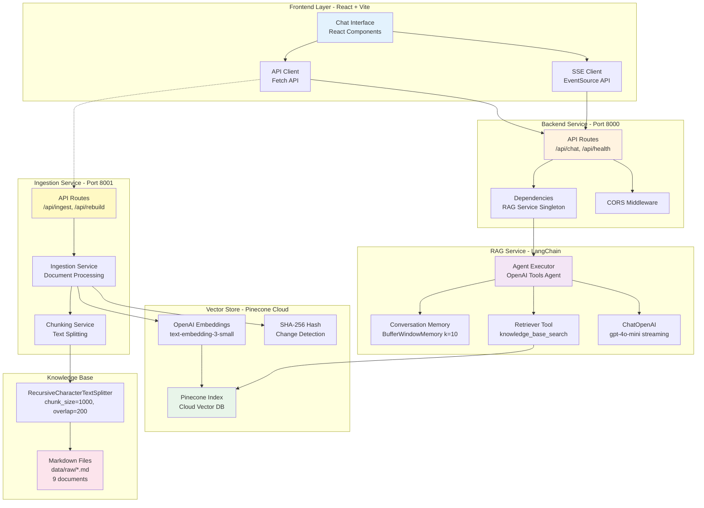
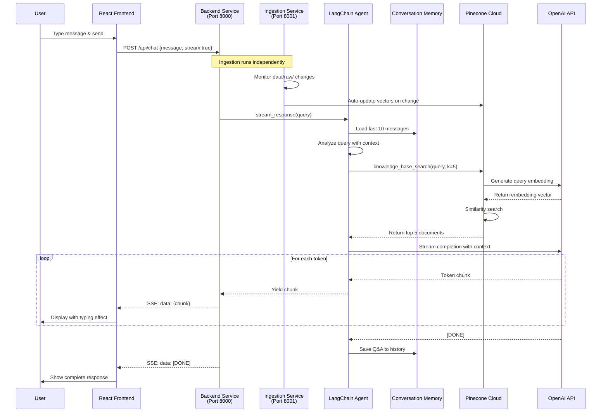
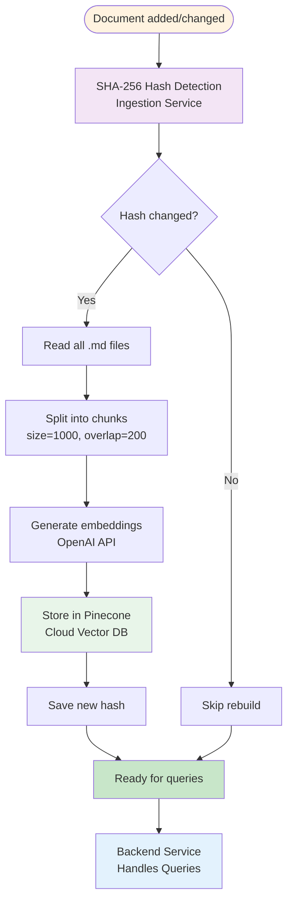
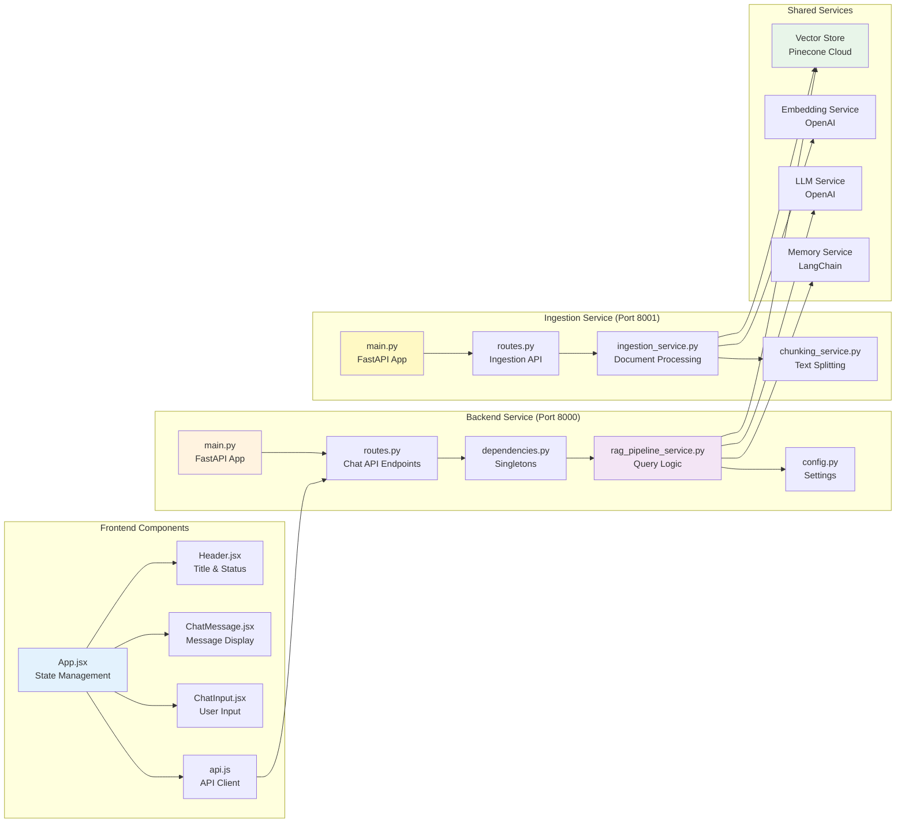
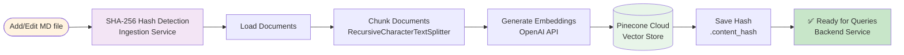
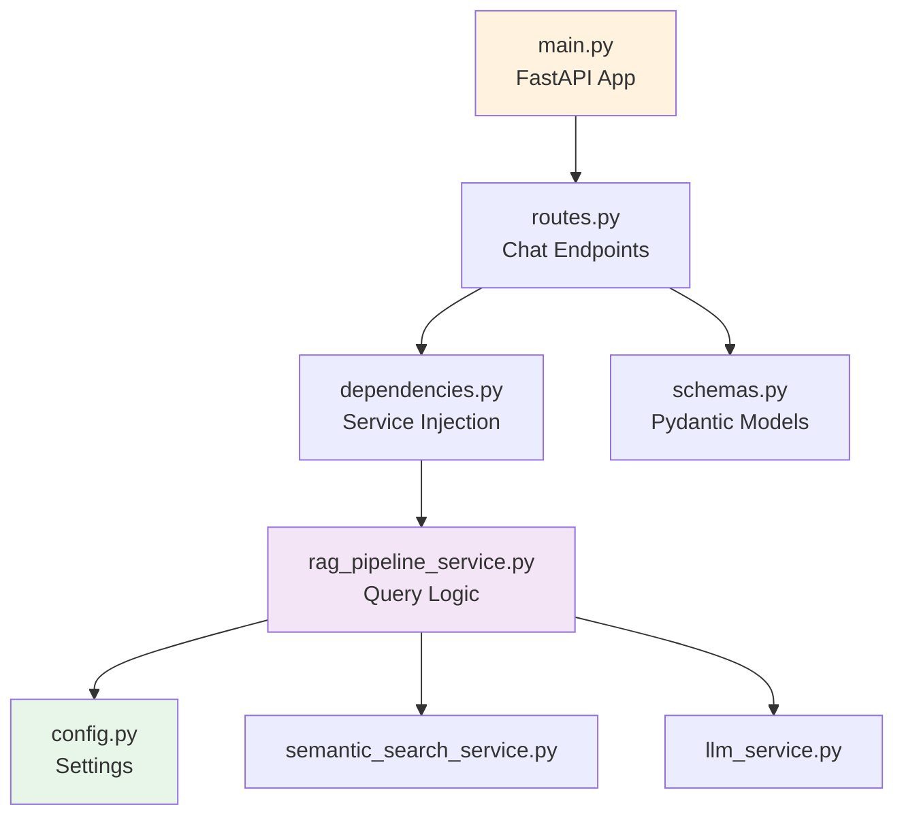
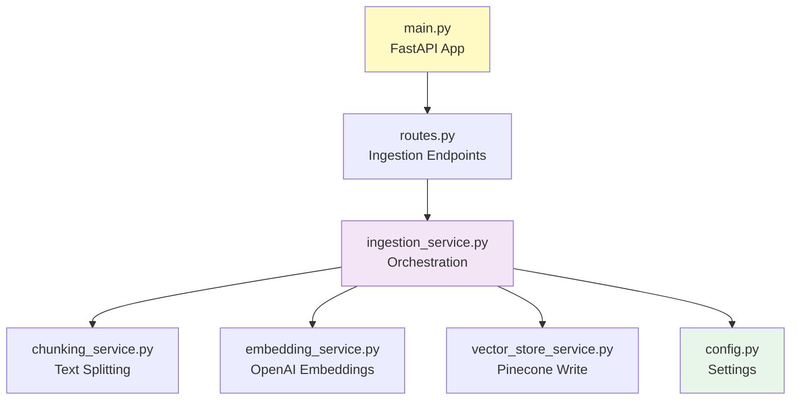
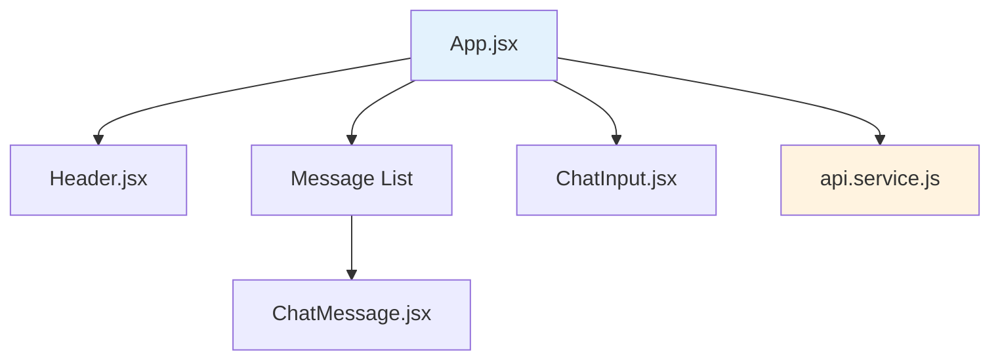
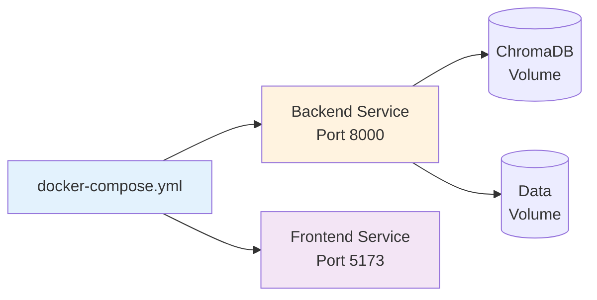

# 🤖 Knowledge Chatbot (Knowra Onboarding Agent)

A production-ready RAG (Retrieval-Augmented Generation) chatbot with streaming responses, built with FastAPI microservices, React, LangChain, and Pinecone.

## 📋 Table of Contents

- [Overview](#-overview)
- [Features](#-features)
- [Architecture](#-architecture)
- [Quick Start](#-quick-start)
- [Project Structure](#-project-structure)
- [API Endpoints](#-api-endpoints)
- [Configuration](#-configuration)
- [Development Guide](#-development-guide)
- [Testing](#-testing)
- [Deployment](#-deployment)
- [Troubleshooting](#-troubleshooting)

## 🎯 Overview

An intelligent chatbot that answers questions from your knowledge base using cutting-edge RAG technology. Perfect for onboarding, documentation search, and knowledge management.

### What It Does

- **Instant Answers**: Get accurate answers from your documentation in seconds
- **Streaming Responses**: Real-time typing effect using Server-Sent Events (SSE)
- **Smart Memory**: Maintains conversation context with 10-message window
- **Microservices Architecture**: Separate ingestion and query services for better scalability
- **Auto-Updates**: Automatically detects and rebuilds vector store on document changes
- **Beautiful UI**: Modern dark-theme interface with smooth animations

### Tech Stack

| Layer | Technology | Purpose |
|-------|-----------|---------|
| **Backend** | FastAPI (Python 3.12) | Query service with SSE streaming |
| **Ingestion** | FastAPI (Python 3.12) | Document processing & vector store management |
| **Frontend** | React 18 + Vite 5 | Modern SPA with hooks |
| **RAG Engine** | LangChain | Document processing & conversational agent |
| **Vector DB** | Pinecone | Cloud-based vector store |
| **LLM** | OpenAI GPT-4o-mini | Response generation |
| **Embeddings** | text-embedding-3-small | Semantic search |
| **Memory** | ConversationBufferWindowMemory | 10-message context window |

## ✨ Features

- 🚀 **Streaming Responses**: Real-time SSE streaming with typing effect
- 🏗️ **Microservices Architecture**: Separate services for ingestion (Port 8001) and queries (Port 8000)
- 🧠 **RAG Pipeline**: Pinecone vector store + OpenAI embeddings + LangChain agent
- 🤖 **Intelligent Agent**: OpenAI tools agent with retriever and conversation memory
- 🔄 **Auto-Rebuild**: SHA-256 hash-based change detection for automatic vector store updates
- 💬 **Conversation History**: ConversationBufferWindowMemory maintains last 10 messages
- 🎨 **Modern UI**: React with dark theme, smooth animations, and auto-scroll
- 📊 **Health Monitoring**: Real-time status, statistics, and document count
- 🧹 **Clear History**: Reset conversation memory with one click
- 🔐 **CORS Enabled**: Configured for frontend-backend communication
- 📄 **Markdown Knowledge Base**: 9 comprehensive documentation files
- ☁️ **Cloud Vector Store**: Pinecone for scalable, distributed vector search

## 🏗️ Architecture

### System Architecture Overview



### Request Flow - Chat Interaction



### Auto-Rebuild System



### Component Architecture



### Data Flow - Document Processing



## 🚀 Quick Start

### Prerequisites

- Python 3.12+
- Node.js 18+
- OpenAI API Key
- Pinecone API Key

### 1. Clone the Repository

```bash
git clone <repository-url>
cd knowra-onboarding-agent
```

### 2. Environment Setup

Create a `.env` file in the root directory:

```env
# OpenAI Configuration
OPENAI_API_KEY=your_openai_api_key_here
OPENAI_EMBEDDING_API_KEY=your_openai_api_key_here

# Pinecone Configuration
PINECONE_API_KEY=your_pinecone_api_key_here
PINECONE_ENVIRONMENT=your_pinecone_environment
PINECONE_INDEX_NAME=knowra-onboarding

# Server Configuration
ALLOWED_ORIGINS=http://localhost:5173,http://localhost:3000
```

### 3. Backend Service Setup (Port 8000)

```bash
# Navigate to backend directory
cd backend

# Create virtual environment
python -m venv venv

# Activate virtual environment
# Windows (PowerShell):
.\venv\Scripts\Activate.ps1
# Windows (CMD):
venv\Scripts\activate.bat
# Linux/Mac:
source venv/bin/activate

# Install dependencies
pip install -r requirements.txt
```

### 4. Ingestion Service Setup (Port 8001)

```bash
# Navigate to ingestion directory (from root)
cd rag-ingestion

# Create virtual environment
python -m venv venv

# Activate virtual environment
# Windows (PowerShell):
.\venv\Scripts\Activate.ps1

# Install dependencies
pip install -r requirements.txt
```

### 5. Frontend Setup

```bash
# Navigate to frontend directory (from root)
cd frontend

# Install dependencies
npm install

# Environment variables are already configured in .env
# Default: VITE_API_URL=http://localhost:8000
```

### 6. Run the Application

**Terminal 1 - Ingestion Service:**

```bash
cd rag-ingestion
python -m uvicorn app.main:app --host 0.0.0.0 --port 8001 --reload
```

**Terminal 2 - Backend Service:**

```bash
cd backend
python -m uvicorn app.main:app --host 0.0.0.0 --port 8000 --reload
```

**Terminal 3 - Frontend:**

```bash
cd frontend
npm run dev
```

### 7. Initial Data Ingestion

After starting the ingestion service, trigger the initial vector store build:

```bash
curl -X POST http://localhost:8001/api/rebuild
```

### 8. Access the Application

- **Frontend**: http://localhost:5173
- **Backend API**: http://localhost:8000
- **Ingestion API**: http://localhost:8001
- **Backend API Docs**: http://localhost:8000/docs
- **Ingestion API Docs**: http://localhost:8001/docs
- **Backend Health**: http://localhost:8000/api/health
- **Ingestion Health**: http://localhost:8001/api/health

## 📁 Project Structure

```
knowra-onboarding-agent/
├── backend/                           # Query Service (Port 8000)
│   ├── app/
│   │   ├── __init__.py
│   │   ├── main.py                    # FastAPI application entry point
│   │   ├── api/
│   │   │   ├── __init__.py
│   │   │   └── routes.py              # Chat API routes
│   │   ├── core/
│   │   │   ├── __init__.py
│   │   │   ├── config.py              # Backend configuration
│   │   │   └── dependencies.py        # Dependency injection
│   │   ├── models/
│   │   │   ├── __init__.py
│   │   │   └── schemas.py             # Request/response models
│   │   ├── services/
│   │   │   ├── __init__.py
│   │   │   └── rag/
│   │   │       ├── __init__.py
│   │   │       ├── embedding_service.py        # Query embeddings
│   │   │       ├── vector_store_service.py     # Read-only Pinecone
│   │   │       ├── semantic_search_service.py  # Similarity search
│   │   │       ├── ranking_service.py          # Result ranking
│   │   │       ├── llm_service.py              # OpenAI streaming
│   │   │       └── rag_pipeline_service.py     # Query orchestration
│   │   └── utils/
│   │       ├── __init__.py
│   │       ├── helpers.py             # Helper functions
│   │       └── logger.py              # Logging configuration
│   └── requirements.txt               # Python dependencies
│
├── rag-ingestion/                     # Ingestion Service (Port 8001)
│   ├── app/
│   │   ├── __init__.py
│   │   ├── main.py                    # FastAPI application entry point
│   │   ├── api/
│   │   │   ├── __init__.py
│   │   │   └── routes.py              # Ingestion API routes
│   │   ├── core/
│   │   │   ├── __init__.py
│   │   │   ├── config.py              # Ingestion configuration
│   │   │   └── dependencies.py        # Dependency injection
│   │   ├── models/
│   │   │   ├── __init__.py
│   │   │   └── schemas.py             # Request/response models
│   │   ├── services/
│   │   │   ├── __init__.py
│   │   │   ├── chunking_service.py    # Document chunking
│   │   │   ├── embedding_service.py   # Embedding generation
│   │   │   ├── vector_store_service.py # Write Pinecone
│   │   │   └── ingestion_service.py   # Ingestion orchestration
│   │   └── utils/
│   │       ├── __init__.py
│   │       └── logger.py              # Logging configuration
│   └── requirements.txt               # Python dependencies
│
├── data/
│   ├── processed/
│   │   └── hybrid_splitter_config.yaml
│   └── raw/                           # Knowledge base markdown files
│       ├── 00_PROJECT_INFO.md
│       ├── 00_README.md
│       ├── 01_ONBOARDING_GUIDE.md
│       ├── 02_BUSINESS_OVERVIEW.md
│       ├── 03_SYSTEM_ARCHITECTURE.md
│       ├── 04_API_REFERENCE.md
│       ├── 05_SOFTWARE_REQUIREMENTS_SPECIFICATION.md
│       ├── 06_TEST_CASE_TEMPLATE.md
│       ├── 07_DEPLOYMENT_GUIDELINES.md
│       └── 08_SECURITY_COMPLIANCE.md
│
├── frontend/                          # React Frontend
│   ├── src/
│   │   ├── components/
│   │   │   ├── Header.jsx             # Header component
│   │   │   ├── ChatMessage.jsx        # Message display
│   │   │   ├── ChatInput.jsx          # Input component
│   │   │   └── index.js               # Component exports
│   │   ├── hooks/
│   │   │   ├── useChat.js             # Chat logic
│   │   │   ├── useHealthCheck.js      # Health monitoring
│   │   │   └── useAutoScroll.js       # Auto-scroll
│   │   ├── services/
│   │   │   └── api.service.js         # API client
│   │   ├── utils/
│   │   │   ├── constants.js           # Constants
│   │   │   ├── formatters.js          # Format helpers
│   │   │   └── helpers.js             # Utility functions
│   │   ├── App.jsx                    # Main app component
│   │   ├── main.jsx                   # React entry point
│   │   └── index.css                  # Global styles
│   ├── index.html                     # HTML template
│   ├── package.json                   # Node dependencies
│   ├── vite.config.js                 # Vite configuration
│   └── .env                           # Frontend environment variables
│
├── docker-compose.yml                 # Docker Compose configuration
├── README.md                          # This file
├── setup.ps1                          # Windows setup script
└── setup.sh                           # Linux/Mac setup script
```

## 📡 API Endpoints

### Backend Service (Port 8000) - Query & Chat

#### Health Check

```http
GET /api/health
```

**Response:**
```json
{
  "status": "healthy",
  "stats": {
    "vector_store_initialized": true,
    "embedding_model": "text-embedding-3-small",
    "llm_model": "gpt-4o-mini",
    "memory_window": 10
  }
}
```

#### Chat (Streaming)

```http
POST /api/chat
Content-Type: application/json

{
  "message": "What is the onboarding process?",
  "stream": true
}
```

**Response:** Server-Sent Events stream
```
data: The onboarding process
data:  consists of
data:  several steps
data: ...
data: [DONE]
```

#### Chat (Non-Streaming)

```http
POST /api/chat
Content-Type: application/json

{
  "message": "What is the onboarding process?",
  "stream": false
}
```

**Response:**
```json
{
  "response": "The onboarding process consists of..."
}
```

#### Clear History

```http
POST /api/clear
```

**Response:**
```json
{
  "message": "Conversation history cleared successfully"
}
```

### Ingestion Service (Port 8001) - Document Processing

#### Health Check

```http
GET /api/health
```

**Response:**
```json
{
  "status": "healthy",
  "stats": {
    "service": "rag-ingestion",
    "version": "1.0.0",
    "pinecone_index": "knowra-onboarding"
  }
}
```

#### Status Check

```http
GET /api/status
```

**Response:**
```json
{
  "initialized": true,
  "documents_count": 9,
  "last_updated": "2025-11-06T01:53:44Z",
  "data_hash": "a1b2c3d4e5f6..."
}
```

#### Ingest Documents

```http
POST /api/ingest
Content-Type: application/json

{
  "force_rebuild": false
}
```

**Response:**
```json
{
  "success": true,
  "message": "Documents ingested successfully",
  "stats": {
    "documents_processed": 9,
    "chunks_created": 150,
    "embeddings_generated": 150
  }
}
```

#### Rebuild Vector Store

```http
POST /api/rebuild
```

**Response:**
```json
{
  "success": true,
  "message": "Vector store rebuilt successfully",
  "stats": {
    "documents_processed": 9,
    "chunks_created": 150,
    "vectors_stored": 150
  }
}
```

## ⚙️ Configuration

### Environment Variables (.env in root directory)

```env
# OpenAI API Configuration (Required)
OPENAI_API_KEY=your_openai_api_key_here
OPENAI_EMBEDDING_API_KEY=your_openai_api_key_here

# Pinecone Configuration (Required)
PINECONE_API_KEY=your_pinecone_api_key_here
PINECONE_ENVIRONMENT=your_pinecone_environment
PINECONE_INDEX_NAME=knowra-onboarding

# Server Configuration
HOST=0.0.0.0
DEBUG=False

# CORS Origins (comma-separated)
ALLOWED_ORIGINS=http://localhost:5173,http://localhost:3000

# RAG Configuration
DATA_DIR=./data/raw
CHUNK_SIZE=1000
CHUNK_OVERLAP=200
RETRIEVER_K=5
MEMORY_WINDOW=10

# OpenAI Models
OPENAI_MODEL=gpt-4o-mini
OPENAI_EMBEDDING_MODEL=text-embedding-3-small
OPENAI_TEMPERATURE=0.7

# Streaming
SSE_DELAY=0.01
```

### Frontend Environment Variables (frontend/.env)

```env
# Backend API URL
VITE_API_URL=http://localhost:8000
```

### Service Ports

| Service | Port | Purpose |
|---------|------|---------|
| **Backend** | 8000 | Query & chat API |
| **Ingestion** | 8001 | Document ingestion API |
| **Frontend** | 5173 | React application |

### Configuration Files

#### backend/app/core/config.py
Backend service configuration:

```python
class Settings(BaseSettings):
    APP_NAME: str = "Knowledge Chatbot API"
    APP_VERSION: str = "1.0.0"
    OPENAI_API_KEY: str
    OPENAI_MODEL: str = "gpt-4o-mini"
    PINECONE_API_KEY: str
    PINECONE_INDEX_NAME: str
    RETRIEVER_K: int = 5
    MEMORY_WINDOW: int = 10
    # ... more settings
```

#### rag-ingestion/app/core/config.py
Ingestion service configuration:

```python
class Settings(BaseSettings):
    APP_NAME: str = "RAG Ingestion Service"
    APP_VERSION: str = "1.0.0"
    OPENAI_API_KEY: str
    OPENAI_EMBEDDING_API_KEY: str
    PINECONE_API_KEY: str
    PINECONE_INDEX_NAME: str
    DATA_DIR: str = "./data/raw"
    CHUNK_SIZE: int = 1000
    CHUNK_OVERLAP: int = 200
    # ... more settings
```

## 🛠️ Development Guide

### Microservices Architecture

The application is split into two independent FastAPI services:

#### Backend Service (Port 8000)
**Purpose**: Query processing and chat interactions
- Handles user queries and chat requests
- Performs semantic search on Pinecone
- Streams responses using LangChain agent
- Maintains conversation memory
- **Read-only** access to vector store

#### Ingestion Service (Port 8001)
**Purpose**: Document processing and vector store management
- Loads and chunks markdown documents
- Generates embeddings
- Writes to Pinecone vector store
- Manages SHA-256 hash for change detection
- **Write** access to vector store

### Backend Service Development

#### Project Structure



#### Key Components

**RAGPipelineService (`backend/app/services/rag/rag_pipeline_service.py`)**

Query service managing the RAG pipeline:

```python
class RAGPipelineService:
    def __init__(self):
        # Initialize services (read-only)
        self.vector_store = VectorStoreService()
        self.search_service = SemanticSearchService()
        self.llm_service = LLMService()
        self.memory = ConversationBufferWindowMemory(k=10)
        self._create_agent()
    
    async def stream_response(self, query: str):
        """Stream response chunks"""
        async for chunk in self.agent_executor.astream({"input": query}):
            if "output" in chunk:
                yield chunk["output"]
```

### Ingestion Service Development

#### Project Structure



#### Key Components

**IngestionService (`rag-ingestion/app/services/ingestion_service.py`)**

Document ingestion orchestration:

```python
class IngestionService:
    def __init__(self):
        self.chunking = ChunkingService()
        self.embedding = EmbeddingService()
        self.vector_store = VectorStoreService()
    
    def process_documents(self, force_rebuild: bool = False):
        """Process and ingest documents"""
        if not force_rebuild and not self._should_rebuild():
            return {"message": "No changes detected"}
        
        # Load and chunk documents
        docs = self.chunking.load_documents()
        chunks = self.chunking.split_documents(docs)
        
        # Generate embeddings and store
        self.vector_store.add_documents(chunks)
        self._save_hash()
```

**Dependencies (`backend/app/core/dependencies.py`)**

Singleton pattern for service management:

```python
_rag_service_instance = None

def get_rag_service() -> RAGPipelineService:
    global _rag_service_instance
    if _rag_service_instance is None:
        _rag_service_instance = RAGPipelineService()
    return _rag_service_instance
```

### Frontend Development

#### Component Hierarchy



#### Key Components

**App.jsx** - Main application component:

```javascript
function App() {
  const [messages, setMessages] = useState([])
  const [isLoading, setIsLoading] = useState(false)
  
  const handleSendMessage = async (messageText) => {
    // Add user message
    setMessages(prev => [...prev, userMessage])
    
    // Stream assistant response
    await sendMessageStream(
      messageText,
      (chunk) => {
        // Update assistant message with chunk
        setMessages(prev => prev.map(msg => 
          msg.id === assistantId 
            ? { ...msg, content: msg.content + chunk }
            : msg
        ))
      },
      () => setIsLoading(false),
      (err) => setError(err)
    )
  }
  
  return (
    <div className="app">
      <Header />
      {messages.map(msg => <ChatMessage key={msg.id} message={msg} />)}
      <ChatInput onSend={handleSendMessage} />
    </div>
  )
}
```

**api.js** - SSE client implementation:

```javascript
export const sendMessageStream = async (message, onChunk, onComplete, onError) => {
  const response = await fetch(`${API_URL}/api/chat`, {
    method: 'POST',
    headers: { 'Content-Type': 'application/json' },
    body: JSON.stringify({ message, stream: true })
  })
  
  const reader = response.body.getReader()
  const decoder = new TextDecoder()
  
  while (true) {
    const { done, value } = await reader.read()
    if (done) break
    
    const text = decoder.decode(value)
    const lines = text.split('\n')
    
    for (const line of lines) {
      if (line.startsWith('data: ')) {
        const data = line.slice(6)
        if (data === '[DONE]') {
          onComplete()
          return
        }
        onChunk(data)
      }
    }
  }
}
```

### Adding New Features

#### 1. Add a New API Endpoint

**Step 1:** Define schema in `backend/app/models/schemas.py`:

```python
class NewFeatureRequest(BaseModel):
    param1: str
    param2: int

class NewFeatureResponse(BaseModel):
    result: str
```

**Step 2:** Add route in `backend/app/api/routes.py`:

```python
@router.post("/api/new-feature", response_model=NewFeatureResponse)
async def new_feature(request: NewFeatureRequest):
    service = get_rag_service()
    result = service.new_feature_method(request.param1, request.param2)
    return NewFeatureResponse(result=result)
```

**Step 3:** Implement in `backend/app/services/rag_service.py`:

```python
def new_feature_method(self, param1: str, param2: int) -> str:
    # Implementation
    return "result"
```

#### 2. Add a Frontend Component

**Step 1:** Create component in `frontend/src/components/NewComponent.jsx`:

```javascript
import React from 'react'

const NewComponent = ({ data }) => {
  return (
    <div className="new-component">
      {/* Component content */}
    </div>
  )
}

export default NewComponent
```

**Step 2:** Import and use in `App.jsx`:

```javascript
import NewComponent from './components/NewComponent'

function App() {
  return (
    <div>
      <NewComponent data={someData} />
    </div>
  )
}
```

### Code Style Guidelines

**Python (Backend)**

- Follow PEP 8
- Use type hints
- Maximum line length: 100 characters
- Use Black for formatting
- Document with docstrings

```python
def function_name(param1: str, param2: int) -> bool:
    """
    Brief description.
    
    Args:
        param1: Description
        param2: Description
    
    Returns:
        bool: Description
    """
    return True
```

**JavaScript/React (Frontend)**

- Use functional components with hooks
- Use arrow functions
- Use const/let (no var)
- Use Prettier for formatting
- Use meaningful variable names

```javascript
const ComponentName = ({ prop1, prop2 }) => {
  const [state, setState] = useState(initialValue)
  
  useEffect(() => {
    // Effect logic
  }, [dependencies])
  
  return <div>{/* JSX */}</div>
}
```

## 🧪 Testing

### Backend Testing

```bash
cd backend
pytest tests/ -v
```

**Example test:**

```python
import pytest
from app.services.rag_service import RAGService

def test_rag_service_initialization():
    service = RAGService()
    assert service.vectorstore is not None
    assert service.agent_executor is not None

def test_chat_response():
    service = RAGService()
    response = service.chat("What is onboarding?")
    assert len(response) > 0
```

### Frontend Testing

```bash
cd frontend
npm test
```

### Manual Testing

**Test Backend API:**

```bash
# Health check
curl http://localhost:8000/api/health

# Chat (non-streaming)
curl -X POST http://localhost:8000/api/chat \
  -H "Content-Type: application/json" \
  -d '{"message": "Hello!", "stream": false}'

# Clear history
curl -X POST http://localhost:8000/api/clear
```

**Test Frontend:**

1. Open http://localhost:5173
2. Type a question and press Enter
3. Watch the response stream in real-time
4. Click "Clear History" to reset conversation

## 🚢 Deployment

### Docker Deployment



**Build and run:**

```bash
# Build images
docker-compose build

# Start services
docker-compose up -d

# View logs
docker-compose logs -f

# Stop services
docker-compose down
```

### Production Deployment Checklist

- [ ] Set production environment variables
- [ ] Use production ASGI server (Gunicorn + Uvicorn)
- [ ] Configure proper CORS origins
- [ ] Set up reverse proxy (Nginx)
- [ ] Enable HTTPS with SSL certificates
- [ ] Build frontend production bundle
- [ ] Set up monitoring and logging
- [ ] Configure backup for ChromaDB
- [ ] Set up error tracking (Sentry)
- [ ] Implement rate limiting
- [ ] Add authentication if needed

### Environment-Specific Configuration

**Development (.env.development)**
```env
DEBUG=True
ALLOWED_ORIGINS=http://localhost:5173
```

**Production (.env.production)**
```env
DEBUG=False
ALLOWED_ORIGINS=https://yourdomain.com
HOST=0.0.0.0
PORT=8000
```

## 🔧 Troubleshooting

### Common Issues

#### Backend won't start

**Issue:** `ModuleNotFoundError` or import errors

**Solution:**
```bash
# Ensure virtual environment is activated
# Windows:
.\venv\Scripts\Activate.ps1
# Linux/Mac:
source venv/bin/activate

# Reinstall dependencies
pip install -r requirements.txt
```

**Issue:** `OpenAI API key not found`

**Solution:**
```bash
# Check .env file exists in backend/ directory
# Verify OPENAI_API_KEY is set correctly
cat backend/.env | grep OPENAI_API_KEY
```

#### Frontend won't start

**Issue:** `Cannot find module` errors

**Solution:**
```bash
cd frontend
rm -rf node_modules package-lock.json
npm install
```

**Issue:** Can't connect to backend

**Solution:**
- Verify backend is running on port 8000
- Check `VITE_API_URL` in `frontend/.env`
- Check CORS configuration in `backend/app/core/config.py`

#### Chat not working

**Issue:** No response from chat

**Solution:**
1. Check backend logs for errors
2. Verify vector store exists: `backend/chroma_db/chroma.sqlite3`
3. Test health endpoint: `http://localhost:8000/api/health`
4. Ensure OpenAI API key is valid and has credits

**Issue:** Vector store not rebuilding

**Solution:**
```bash
# Delete hash file to force rebuild
rm backend/chroma_db/.content_hash

# Or rebuild manually via API
curl -X POST http://localhost:8000/api/rebuild
```

### Debug Mode

**Enable verbose logging:**

```python
# backend/app/core/config.py
DEBUG = True

# backend/app/services/rag_service.py
self.agent_executor = AgentExecutor(
    agent=agent,
    tools=[retriever_tool],
    verbose=True,  # Enable verbose logging
    memory=self.memory
)
```

### Performance Issues

**Issue:** Slow response times

**Solutions:**
- Reduce `CHUNK_SIZE` for faster embedding generation
- Reduce `RETRIEVER_K` for fewer documents retrieved
- Use smaller embedding model (though less accurate)
- Enable caching for embeddings

**Issue:** High memory usage

**Solutions:**
- Reduce `MEMORY_WINDOW` size
- Clear conversation history more frequently
- Reduce `CHUNK_OVERLAP` to create fewer chunks

## 📚 Additional Resources

### Documentation Links

- [FastAPI Documentation](https://fastapi.tiangolo.com/)
- [React Documentation](https://react.dev/)
- [LangChain Documentation](https://python.langchain.com/)
- [ChromaDB Documentation](https://docs.trychroma.com/)
- [OpenAI API Documentation](https://platform.openai.com/docs)

### Learning Resources

- [RAG Tutorial](https://python.langchain.com/docs/tutorials/rag/)
- [Server-Sent Events](https://developer.mozilla.org/en-US/docs/Web/API/Server-sent_events)
- [React Hooks](https://react.dev/reference/react)

## 🤝 Contributing

We welcome contributions! Please follow these guidelines:

1. Fork the repository
2. Create a feature branch: `git checkout -b feature/your-feature`
3. Make your changes
4. Write/update tests
5. Update documentation
6. Submit a pull request

### Commit Message Convention

```
feat: Add new feature
fix: Fix bug
docs: Update documentation
style: Format code
refactor: Refactor code
test: Add tests
chore: Update dependencies
```

## 📄 License

This project is licensed under the MIT License - see the [LICENSE](LICENSE) file for details.

## 👥 Team

- **Project Repository**: [knowra-onboarding-agent](https://github.com/NinobraV/knowra-onboarding-agent)
- **Current Branch**: develop/prepare-data

## 📊 Project Status

**Version**: 1.0.0  
**Status**: Active Development  
**Last Updated**: October 29, 2025

---

**Built with ❤️ using FastAPI, React, LangChain, and ChromaDB**
