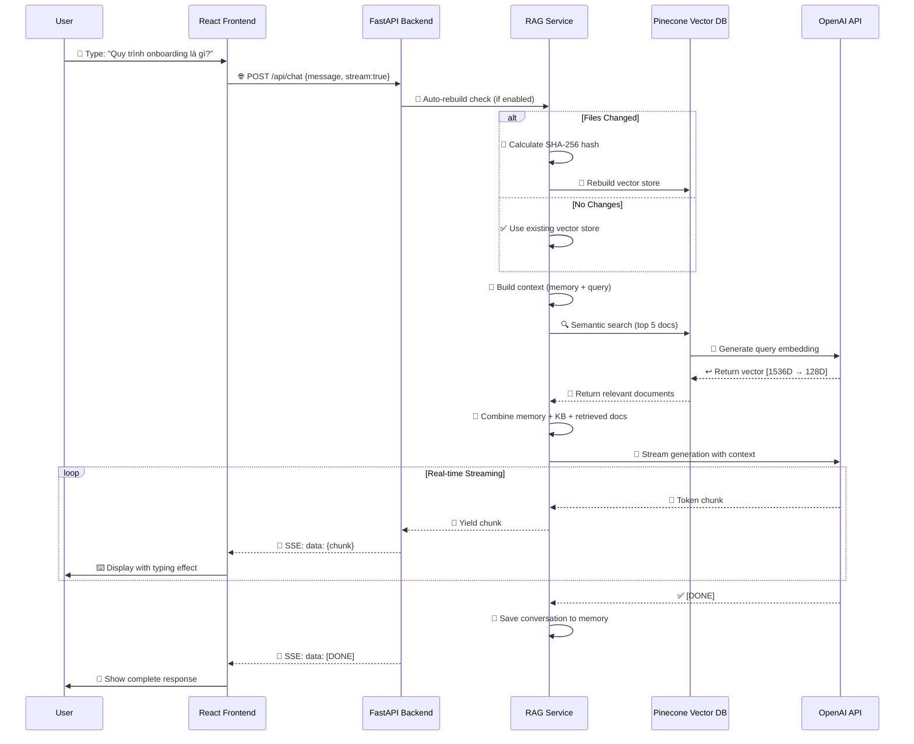
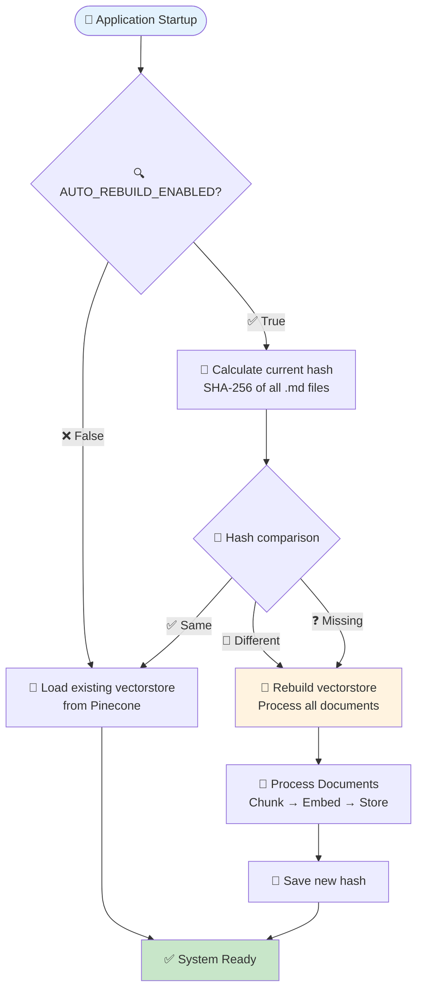
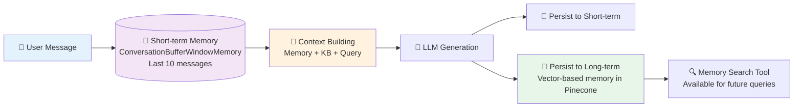
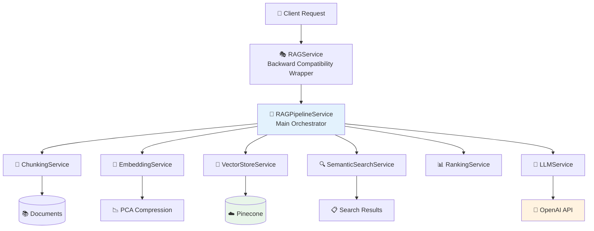
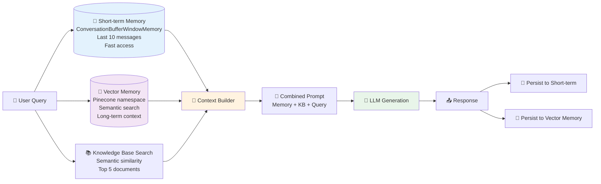

# 📋 Tóm Tắt Tổng Quan (Overview) - Knowra Onboarding Agent

## 1. 🎯 Mục Đích Của Dự Án

**Knowra Onboarding Agent** là một **chatbot thông minh sử dụng công nghệ RAG (Retrieval-Augmented Generation)** được thiết kế để:

### 🔍 **RAG là gì?**
- **Retrieval**: Tìm kiếm thông tin liên quan từ knowledge base
- **Augmented**: Bổ sung thông tin tìm được vào context của LLM
- **Generation**: LLM tạo câu trả lời dựa trên context đã được bổ sung

### 🎯 **Chức Năng Chính**
- **Trả lời tức thời**: Cung cấp câu trả lời chính xác từ cơ sở tri thức nội bộ trong vài giây
- **Hỗ trợ onboarding**: Giúp nhân viên mới làm quen với quy trình, tài liệu công ty
- **Tìm kiếm tài liệu**: Tìm kiếm thông tin từ tài liệu nội bộ một cách thông minh
- **Quản lý tri thức**: Tự động xây dựng và cập nhật cơ sở tri thức từ file Markdown

### 💼 **Use Cases Thực Tế**
```
Nhân viên mới: "Quy trình onboarding của công ty là gì?"
→ System tự động tìm trong 9 file tài liệu
→ Trả lời: "Quy trình onboarding gồm 5 bước: 1) Đăng ký tài khoản..."

Developer: "API authentication hoạt động như thế nào?"  
→ System tìm trong API documentation
→ Trả lời chi tiết về authentication flow
```

**Bối cảnh**: Dự án này được phát triển cho hệ thống **Hotel Booking System (HBS)** - một nền tảng đặt phòng khách sạn toàn diện sử dụng .NET Core, React, PostgreSQL.

## 2. 🏗️ Cấu Trúc Thư Mục Chính

### 📁 **Architecture Pattern: Layered + Modular**
```
knowra-onboarding-agent/
├── backend/                          # 🐍 Backend FastAPI (Python)
│   ├── app/
│   │   ├── main.py                   # 🚀 Entry point FastAPI application
│   │   ├── api/routes.py             # 🛣️  API endpoints (/chat, /health, /clear)
│   │   ├── core/                     # ⚙️  Core infrastructure
│   │   │   ├── config.py             #     └── Pydantic settings, env variables
│   │   │   └── dependencies.py       #     └── Dependency injection, singletons
│   │   ├── models/schemas.py         # 📋 Pydantic models (request/response)
│   │   ├── services/                 # 🧠 Business logic layer
│   │   │   ├── rag_service.py        #     └── RAG wrapper (backward compatibility)
│   │   │   └── rag/                  #     └── 🔧 Modular RAG services
│   │   │       ├── rag_pipeline_service.py    # 🎭 Main orchestrator
│   │   │       ├── chunking_service.py        # 📄 Document processing
│   │   │       ├── embedding_service.py       # 🧠 OpenAI embeddings + PCA
│   │   │       ├── vector_store_service.py    # 💾 Pinecone integration
│   │   │       ├── semantic_search_service.py # 🔍 Search operations
│   │   │       ├── ranking_service.py         # 📊 Result ranking & filtering
│   │   │       └── llm_service.py            # 🤖 LLM interactions & streaming
│   │   └── utils/                    # 🛠️  Helper functions & logging
│   ├── requirements.txt              # 📦 Python dependencies (40+ packages)
│   └── .vectorstore/                 # 🔐 SHA-256 hash storage for auto-rebuild
│
├── frontend/                         # ⚛️  React frontend (JavaScript)
│   ├── src/
│   │   ├── App.jsx                   # 🏠 Main app component (state management)
│   │   ├── components/               # 🧩 UI components
│   │   │   ├── ChatInput.jsx         #     └── 💬 User input with validation
│   │   │   ├── ChatMessage.jsx       #     └── 💭 Message display + streaming
│   │   │   ├── MessageList.jsx       #     └── 📜 Message container + auto-scroll
│   │   │   ├── StatusBar.jsx         #     └── 📊 Health monitoring
│   │   │   └── ErrorBanner.jsx       #     └── ⚠️  Error handling
│   │   ├── hooks/                    # 🪝 Custom React hooks
│   │   │   ├── useChat.js            #     └── Chat state management
│   │   │   ├── useHealthCheck.js     #     └── Real-time health monitoring
│   │   │   └── useAutoScroll.js      #     └── Auto-scroll behavior
│   │   ├── services/api.service.js   # 🌐 API client (fetch + SSE)
│   │   └── utils/                    # 🛠️  Frontend utilities
│   ├── package.json                  # 📦 Node dependencies (React ecosystem)
│   └── vite.config.js               # ⚡ Vite build configuration
│
├── data/raw/                         # 📚 Knowledge base (9 markdown files)
│   ├── 00_PROJECT_INFO.md           #     └── 🏢 Project overview & terminology
│   ├── 01_ONBOARDING_GUIDE.md       #     └── 👋 New employee guide
│   ├── 02_BUSINESS_OVERVIEW.md      #     └── 💼 Business context & goals
│   ├── 03_SYSTEM_ARCHITECTURE.md    #     └── 🏗️  Technical architecture
│   ├── 04_API_REFERENCE.md          #     └── 📡 API documentation
│   ├── 05_SOFTWARE_REQUIREMENTS_SPECIFICATION.md # └── 📋 Requirements
│   ├── 06_TEST_CASE_TEMPLATE.md     #     └── 🧪 Testing guidelines
│   ├── 07_DEPLOYMENT_GUIDELINES.md  #     └── 🚀 Deployment procedures
│   └── 08_SECURITY_COMPLIANCE.md    #     └── 🔒 Security standards
│
├── docker-compose.yml               # 🐳 Container orchestration (backend + frontend)
└── README.md                       # 📖 Comprehensive documentation (1000+ lines)
```

### 🏛️ **Design Patterns Được Sử Dụng**

#### **Backend Patterns:**
- **Layered Architecture**: API → Services → Infrastructure
- **Dependency Injection**: Singleton pattern cho RAG service
- **Factory Pattern**: Service creation và initialization
- **Observer Pattern**: SSE streaming cho real-time updates

#### **Frontend Patterns:**  
- **Component Composition**: Reusable UI components
- **Custom Hooks**: State logic separation
- **Provider Pattern**: Context cho global state
- **Error Boundaries**: Graceful error handling

## 3. 🛠️ Công Nghệ & Thư Viện Chính

### 🐍 **Backend Stack**
| Công nghệ | Vai trò | Phiên bản | Lý do chọn |
|-----------|---------|-----------|------------|
| **FastAPI** | REST API framework | 0.115.6 | Async, auto-docs, type hints, performance |
| **Python** | Backend language | 3.14+ | AI/ML ecosystem, readable code |
| **LangChain** | RAG framework | 0.3.13 | Rich ecosystem, pre-built components |
| **LangGraph** | Agent orchestration | 0.2.40 | State management, complex workflows |
| **Pinecone** | Vector database (cloud) | 5.0.1 | Managed service, no infrastructure |
| **OpenAI** | LLM & Embeddings | 1.55.3 | State-of-the-art models |
| **Uvicorn** | ASGI server | 0.32.1 | High performance async server |
| **Pydantic** | Data validation | 2.4.0+ | Type safety, auto-validation |

### ⚛️ **Frontend Stack**
| Công nghệ | Vai trò | Phiên bản | Lý do chọn |
|-----------|---------|-----------|------------|
| **React** | UI framework | 18.2.0 | Component-based, large community |
| **Vite** | Build tool | 5.0.8 | Fast HMR, modern build system |
| **JavaScript** | Frontend language | ES6+ | Native web language, no compilation |
| **CSS** | Styling | Modern CSS | Custom properties, flexbox, grid |
| **EventSource** | SSE client | Native API | Real-time streaming, auto-reconnect |

### 🤖 **AI/ML Stack**
| Component | Technology | Specification | Purpose |
|-----------|------------|---------------|---------|
| **LLM Model** | GPT-4o-mini | Latest OpenAI | Fast, cost-effective generation |
| **Embedding Model** | text-embedding-3-small | 1536 dimensions | Semantic similarity search |
| **Vector Database** | Pinecone | Cloud-hosted | Managed vector operations |
| **Memory System** | ConversationBufferWindowMemory | 10 messages | Context management |
| **PCA Compression** | scikit-learn | 1536→128 dims | Reduce storage & compute |
| **Agent Framework** | LangGraph | React pattern | Tool-based reasoning |

### 📦 **Key Dependencies Deep Dive**

#### **Backend Critical Packages:**
```python
# Core API
fastapi==0.115.6              # Modern Python web framework
uvicorn[standard]==0.32.1     # ASGI server with auto-reload

# AI/ML Stack  
langchain==0.3.13             # RAG framework
langchain-openai==0.2.10      # OpenAI integration
langgraph==0.2.40             # Agent workflows
openai==1.55.3                # OpenAI Python client
pinecone-client==5.0.1        # Vector database client

# Data Processing
scikit-learn==1.7.2           # PCA compression
pydantic-settings==2.4.0      # Configuration management
python-dotenv==1.0.1          # Environment variables
```

#### **Frontend Critical Packages:**
```json
{
  "react": "^18.2.0",           // UI library
  "react-dom": "^18.2.0",       // DOM rendering
  "vite": "^5.0.8",            // Build tool
  "eslint": "^8.55.0",         // Code linting
  "prop-types": "^15.8.1"      // Runtime type checking
}
```

### 🔄 **Technology Decision Rationale**

#### **Why FastAPI over Flask/Django?**
- ✅ Native async support
- ✅ Automatic API documentation (Swagger/OpenAPI)
- ✅ Type hints integration
- ✅ High performance (comparable to Node.js)
- ✅ SSE streaming support

#### **Why Pinecone over Chroma/Weaviate?**
- ✅ Fully managed (no infrastructure)
- ✅ Horizontal scaling
- ✅ Built-in metadata filtering
- ✅ High availability
- ⚠️ Cost consideration for large datasets

#### **Why React over Vue/Angular?**
- ✅ Large ecosystem & community
- ✅ Excellent SSE support via EventSource
- ✅ Flexible component architecture
- ✅ Rich debugging tools
- ✅ Team familiarity

## 4. 🔄 Luồng Hoạt Động Chính (Main Workflow)

### 💬 **Chat Interaction Flow (Real-time Streaming)**



### 📄 **Document Processing Flow (Initialization)**

```mermaid
flowchart TD
    START([📁 Markdown Files in data/raw/]) --> LOAD[📖 ChunkingService.load_documents]
    LOAD --> CHUNK[✂️ Text Splitting<br/>RecursiveCharacterTextSplitter<br/>size=1000, overlap=200]
    
    CHUNK --> META[📋 Metadata Extraction<br/>• YAML frontmatter<br/>• Section headers<br/>• Source file info]
    
    META --> HEADERS[📑 Section Headers<br/>Prepend context to chunks<br/>"## Overview" → chunk content]
    
    HEADERS --> EMBED[🧠 EmbeddingService<br/>OpenAI text-embedding-3-small<br/>1536 dimensions]
    
    EMBED --> PCA[📊 PCA Compression<br/>1536D → 128D<br/>Reduce storage cost]
    
    PCA --> STORE[💾 VectorStoreService<br/>Pinecone cloud index<br/>with metadata]
    
    STORE --> HASH[🔐 SHA-256 Hash<br/>Save to .vectorstore/.content_hash<br/>For change detection]
    
    HASH --> READY[✅ Ready for Queries]
    
    style START fill:#e3f2fd
    style CHUNK fill:#f3e5f5  
    style EMBED fill:#fff3e0
    style STORE fill:#e8f5e9
    style READY fill:#c8e6c9
```

### 🔄 **Auto-Rebuild Detection System**



### 🧠 **Memory Management Flow**



### ⚡ **Performance Optimizations**

1. **Embedding Caching**: Cache embeddings để tránh regenerate
2. **PCA Compression**: 1536D → 128D giảm 88% storage
3. **Streaming**: Không chờ complete response
4. **Memory Window**: Limit 10 messages để control token usage
5. **Hash-based Rebuild**: Chỉ rebuild khi cần thiết

## 5. 🧩 Các Module/Feature Chính

### 🐍 **Backend Modules (Modular RAG Architecture)**

#### 🎭 **RAGPipelineService** (Main Orchestrator)
```python
class RAGPipelineService:
    """
    🎯 Vai trò: Điều phối toàn bộ luồng RAG workflow
    🔧 Tính năng: Agent execution, memory integration, streaming
    🛠️ Công nghệ: LangGraph React Agent với tools
    """
    
    def __init__(self):
        # Initialize all sub-services
        self.chunking_service = ChunkingService(...)
        self.embedding_service = EmbeddingService(...)  
        self.vector_store_service = VectorStoreService(...)
        self.llm_service = LLMService(...)
        
        # Create agent with tools
        self.agent_executor = create_react_agent(llm, tools=[
            knowledge_base_search,  # Vector search tool
            memory_search          # Memory retrieval tool  
        ])
    
    async def stream_response(self, query: str):
        """🌊 Stream response từ agent với memory + KB context"""
        # 1. 🛡️ Moderation check
        # 2. 🧠 Build combined context (memory + KB + query)  
        # 3. 🤖 Call agent executor with tools
        # 4. 📡 Stream response chunks via SSE
        # 5. � Persist conversation to memory
```

#### �📄 **ChunkingService** (Document Processing)
```python
class ChunkingService:
    """
    🎯 Vai trò: Xử lý và phân đoạn tài liệu thông minh
    🔧 Tính năng: Hierarchical splitting, metadata extraction, section headers
    🛠️ Thuật toán: RecursiveCharacterTextSplitter với semantic separators
    """
    
    def __init__(self):
        # Hierarchical separators cho semantic chunking
        self.separators = [
            "\n\n---\n\n",  # 📑 Document sections
            "\n## ",         # 📋 H2 headers  
            "\n### ",        # 📌 H3 headers
            "\n\n",          # 📄 Paragraphs
            ". ",            # 📝 Sentences
            " ", ""          # 🔤 Words, Characters
        ]
    
    def process(self, data_dir: Path) -> List[Document]:
        """📚 Load → Chunk → Post-process documents"""
        documents = self.load_documents(data_dir)  # 📁 Load .md files
        chunks = self.split_documents(documents)    # ✂️ Intelligent splitting
        chunks = self._post_process_chunks(chunks)  # 🧹 Filter & merge
        return chunks
```

#### 🧠 **EmbeddingService** (Vector Generation)
```python
class EmbeddingService:
    """
    🎯 Vai trò: Tạo vector embeddings với compression
    🔧 Tính năng: OpenAI API integration, PCA compression, caching
    🛠️ Model: text-embedding-3-small → 1536D → 128D (compressed)
    """
    
    def __init__(self, pca_components=128):
        self.openai_embeddings = OpenAIEmbeddings(
            model="text-embedding-3-small"  # 1536 dimensions
        )
        self.pca = PCA(n_components=pca_components)  # 128 dimensions
        self.is_fitted = False
    
    def embed_documents(self, texts: List[str]) -> List[List[float]]:
        """📊 Generate & compress embeddings"""
        # 1. 🧠 Generate OpenAI embeddings (1536D)
        # 2. 📉 Apply PCA compression (128D) 
        # 3. 💾 Cache results
        # 4. ↩️ Return compressed vectors
```

#### 💾 **VectorStoreService** (Database Management)  
```python
class VectorStoreService:
    """
    🎯 Vai trò: Quản lý Pinecone vector database
    🔧 Tính năng: Create/load vectorstore, semantic search, auto-rebuild detection
    🛠️ Storage: Cloud-hosted Pinecone index với metadata filtering
    """
    
    def __init__(self, pinecone_api_key, index_name):
        self.pc = Pinecone(api_key=pinecone_api_key)
        self.index = self.pc.Index(index_name)
    
    def should_rebuild(self) -> bool:
        """🔍 Check if rebuild needed via SHA-256 hash"""
        current_hash = self._calculate_files_hash()
        stored_hash = self._load_stored_hash()
        return current_hash != stored_hash
    
    def semantic_search(self, query: str, k: int = 5) -> List[Document]:
        """🔍 High-level semantic search by query text"""
        # 1. 🧠 Generate query embedding
        # 2. 🔍 Pinecone similarity search
        # 3. 📄 Convert to LangChain Documents
        # 4. ↩️ Return top k results
```

#### 🔍 **SemanticSearchService** (Information Retrieval)
```python
class SemanticSearchService:
    """
    🎯 Vai trò: Tìm kiếm ngữ nghĩa và xử lý query
    🔧 Tính năng: Query processing, similarity search, result filtering
    🛠️ Algorithm: Vector similarity + metadata filtering
    """
    
    def semantic_search(self, query: str, k: int = 5) -> List[Document]:
        """🔍 Execute semantic search với score filtering"""
        # 1. 🧹 Preprocess query
        # 2. 🔍 Call vector store search
        # 3. 📊 Apply score threshold filtering
        # 4. 📋 Add metadata enrichment
        # 5. ↩️ Return ranked results
```

#### 🤖 **LLMService** (AI Generation)
```python  
class LLMService:
    """
    🎯 Vai trò: Tương tác với OpenAI LLM
    🔧 Tính năng: Streaming generation, memory management, moderation
    🛠️ Model: GPT-4o-mini với custom prompts và memory integration
    """
    
    def __init__(self, openai_api_key, model="gpt-4o-mini"):
        self.llm = ChatOpenAI(
            api_key=openai_api_key,
            model=model,
            temperature=0.0,
            streaming=True
        )
        self.memory_store = ConversationMemoryLight(window=10)
    
    async def generate_answer_stream(self, query: str) -> AsyncGenerator[str, None]:
        """🌊 Stream response với memory context"""
        # 1. 🧠 Load conversation memory
        # 2. 🔗 Build context prompt
        # 3. 🤖 Stream from LLM
        # 4. 💾 Persist response to memory
```

### ⚛️ **Frontend Features (React Components)**

#### 💬 **Chat Interface Components**
```javascript
// 🏠 App.jsx - Main application component
function App() {
  const { messages, sendMessage, isLoading } = useChat()
  const { healthStatus } = useHealthCheck()
  
  return (
    <div className="app">
      <Header />
      <StatusBar healthStatus={healthStatus} />
      <MessageList messages={messages} />
      <ChatInput onSend={sendMessage} disabled={isLoading} />
    </div>
  )
}

// 💭 ChatMessage.jsx - Message display với streaming effect
function ChatMessage({ message }) {
  return (
    <div className={`message ${message.role}`}>
      <div className="content">
        {message.isStreaming ? (
          <TypewriterEffect text={message.content} />
        ) : (
          message.content
        )}
      </div>
      <div className="timestamp">{formatTime(message.timestamp)}</div>
    </div>
  )
}

// 💬 ChatInput.jsx - User input với validation
function ChatInput({ onSend, disabled, maxChars = 500 }) {
  const [input, setInput] = useState('')
  
  const handleSubmit = (e) => {
    e.preventDefault()
    if (input.trim() && !disabled) {
      onSend(input.trim())
      setInput('')
    }
  }
  
  return (
    <form onSubmit={handleSubmit}>
      <textarea 
        value={input}
        onChange={(e) => setInput(e.target.value)}
        maxLength={maxChars}
        placeholder="Hỏi về quy trình onboarding..."
      />
      <button type="submit" disabled={disabled || !input.trim()}>
        Send
      </button>
    </form>
  )
}
```

#### 📊 **Health Monitoring Components**
```javascript
// 📊 StatusBar.jsx - Real-time system status
function StatusBar({ healthStatus, isLoading }) {
  return (
    <div className="status-bar">
      <div className={`status ${healthStatus?.status}`}>
        {healthStatus?.status === 'healthy' ? '🟢' : '🔴'} 
        {healthStatus?.status || 'checking...'}
      </div>
      
      {healthStatus?.stats && (
        <div className="stats">
          📚 {healthStatus.stats.documents_loaded} docs
          📊 {healthStatus.stats.chunking.total_chunks} chunks
          🤖 {healthStatus.stats.llm.model}
        </div>
      )}
      
      {isLoading && <div className="typing-indicator">🤖 Typing...</div>}
    </div>
  )
}

// ⚠️ ErrorBanner.jsx - Error handling UI
function ErrorBanner({ message, onDismiss, dismissible = true }) {
  return (
    <div className="error-banner">
      <span>⚠️ {message}</span>
      {dismissible && (
        <button onClick={onDismiss}>✕</button>
      )}
    </div>
  )
}
```

#### 🪝 **Custom React Hooks**
```javascript
// 🪝 useChat.js - Chat state management
export function useChat() {
  const [messages, setMessages] = useState([])
  const [isLoading, setIsLoading] = useState(false)
  const [error, setError] = useState(null)
  
  const sendMessage = useCallback(async (messageText) => {
    // 1. 📝 Add user message
    // 2. 🌐 Call API with streaming
    // 3. 🌊 Handle SSE response
    // 4. 🤖 Update assistant message in real-time
  }, [])
  
  return { messages, sendMessage, isLoading, error }
}

// 🪝 useHealthCheck.js - Real-time health monitoring  
export function useHealthCheck(enabled = true) {
  const [healthStatus, setHealthStatus] = useState(null)
  const [error, setError] = useState(null)
  
  useEffect(() => {
    if (!enabled) return
    
    const checkHealth = async () => {
      try {
        const status = await apiService.checkHealth()
        setHealthStatus(status)
      } catch (err) {
        setError(err.message)
      }
    }
    
    checkHealth()
    const interval = setInterval(checkHealth, 30000) // 30s
    return () => clearInterval(interval)
  }, [enabled])
  
  return { healthStatus, error }
}

// 🪝 useAutoScroll.js - Auto-scroll behavior
export function useAutoScroll(dependencies) {
  const messagesEndRef = useRef(null)
  
  useEffect(() => {
    messagesEndRef.current?.scrollIntoView({ 
      behavior: 'smooth' 
    })
  }, dependencies)
  
  return messagesEndRef
}
```

## 6. ✨ Điểm Nổi Bật & Logic Quan Trọng

### 🔥 **Modular RAG Architecture (Microservice trong Monolith)**


**🎯 Design Benefits:**
- **Single Responsibility**: Mỗi service có 1 nhiệm vụ rõ ràng
- **Dependency Injection**: Easy testing và mocking
- **Interface Segregation**: Clear contracts giữa services
- **Maintainability**: Dễ debug, update từng component
- **Scalability**: Có thể tách thành microservices thực sự

### 🚀 **Advanced Streaming with SSE (Server-Sent Events)**
```javascript
// 🎯 Tại sao chọn SSE thay vì WebSocket?
// ✅ Unidirectional (phù hợp cho chat response)
// ✅ Auto-reconnection built-in
// ✅ Simpler implementation  
// ✅ HTTP/2 multiplexing support
// ✅ No custom protocol needed

// Frontend: EventSource API
async function streamChat(message) {
  const response = await fetch('/api/chat', {
    method: 'POST',
    headers: { 'Content-Type': 'application/json' },
    body: JSON.stringify({ message, stream: true })
  })
  
  const reader = response.body.getReader()
  const decoder = new TextDecoder()
  
  while (true) {
    const { done, value } = await reader.read()
    if (done) break
    
    const chunk = decoder.decode(value)
    const lines = chunk.split('\n')
    
    for (const line of lines) {
      if (line.startsWith('data: ')) {
        const data = line.slice(6)
        if (data === '[DONE]') return
        
        // 🌊 Real-time UI update
        updateMessageContent(data)
      }
    }
  }
}

// Backend: StreamingResponse
async def chat_stream(message: str):
    async def event_generator():
        async for chunk in rag_service.stream_response(message):
            yield f"data: {chunk}\n\n"  # SSE format
        yield "data: [DONE]\n\n"
    
    return StreamingResponse(
        event_generator(),
        media_type="text/event-stream",
        headers={
            "Cache-Control": "no-cache",
            "Connection": "keep-alive"
        }
    )
```

### 🧠 **Intelligent Memory System (Hybrid Approach)**



**🧠 Memory Strategy Explanation:**
```python
def _build_combined_system(self, query: str) -> str:
    """Xây dựng context thông minh từ nhiều nguồn"""
    
    # 1. 💭 Short-term memory (recent conversation)
    recent_messages = self.llm_service.get_memory_instance()
    memory_text = format_conversation_history(recent_messages)
    
    # 2. 🧠 Long-term memory (semantic search trong history)
    if hasattr(self.llm_service, 'memory'):
        relevant_history = self.llm_service.memory.get_relevant_context(query, k=3)
    
    # 3. 📚 Knowledge base search  
    kb_documents = self.search_service.semantic_search(query, k=5)
    kb_text = format_documents(kb_documents)
    
    # 4. 🔗 Combine all contexts với priority
    combined_context = f"""
    You are a helpful assistant with access to:
    
    Recent Conversation (high priority):
    {memory_text}
    
    Relevant Past Interactions (medium priority):
    {relevant_history}
    
    Knowledge Base (context for facts):
    {kb_text}
    
    Current Query: {query}
    """
    
    # 5. 🎯 Token limit enforcement
    return self.llm_service._enforce_token_limit(combined_context)
```

### 🔄 **Smart Auto-Rebuild Detection System**
```python
class VectorStoreService:
    def _calculate_files_hash(self) -> str:
        """🔐 Calculate SHA-256 hash của tất cả markdown files"""
        hasher = hashlib.sha256()
        
        # 📁 Get all markdown files sorted (consistent order)
        md_files = sorted(self.data_dir.glob("*.md"))
        
        for file_path in md_files:
            # 📄 Include file path và content
            hasher.update(str(file_path).encode())
            hasher.update(file_path.read_bytes())
            
        return hasher.hexdigest()
    
    def should_rebuild(self) -> bool:
        """🔍 Intelligent rebuild decision"""
        current_hash = self._calculate_files_hash()
        stored_hash = self._load_stored_hash()
        
        # 🆕 First time setup
        if stored_hash is None:
            logger.info("🔨 First time setup - building vector store")
            return True
            
        # 🔄 Files changed  
        if current_hash != stored_hash:
            logger.info(f"📝 Files changed - rebuild needed")
            logger.info(f"Previous: {stored_hash[:8]}...")
            logger.info(f"Current:  {current_hash[:8]}...")
            return True
            
        # ✅ No changes
        logger.info("✅ Files unchanged - using existing vector store")
        return False
```

### 🎯 **Agent-Based RAG with LangGraph**
```python
def _create_agent(self) -> None:
    """🤖 Create intelligent agent với specialized tools"""
    
    # 📚 Knowledge Base Search Tool
    def knowledge_base_search(query: str) -> str:
        """Search company documentation"""
        try:
            docs = self.search_service.semantic_search(query, k=self.retriever_k)
            if not docs:
                return "No relevant information found in knowledge base."
            
            # 📄 Format results với metadata
            formatted_results = []
            for doc in docs:
                source = doc.metadata.get('source', 'Unknown')
                content = doc.page_content
                formatted_results.append(f"Source: {source}\n{content}")
                
            return "\n\n---\n\n".join(formatted_results)
        except Exception as e:
            return f"Error searching knowledge base: {e}"
    
    # 🧠 Memory Search Tool
    def memory_search(query: str) -> str:
        """Search conversation history"""
        try:
            if not hasattr(self.llm_service, 'memory'):
                return "Memory search not available."
                
            relevant_items = self.llm_service.memory.get_relevant_context(query, k=3)
            return "\n\n".join(relevant_items) if relevant_items else "No relevant memory found."
        except Exception as e:
            return f"Error searching memory: {e}"
    
    # 🛠️ Create tools
    tools = [
        Tool(
            name="knowledge_base_search",
            description="Search company docs (onboarding, architecture, API, deployment). Input: query string.",
            func=knowledge_base_search
        ),
        Tool(
            name="memory_search", 
            description="Search conversation memory for relevant past interactions. Input: query string.",
            func=memory_search
        )
    ]
    
    # 🎭 Create React agent
    llm = self.llm_service.get_llm_instance()
    self.agent_executor = create_react_agent(llm, tools=tools)
```

### 🔐 **Environment-Aware Configuration System**
```python
class Settings(BaseSettings):
    """🔧 Production-ready configuration với validation"""
    model_config = SettingsConfigDict(
        env_file="../.env",
        case_sensitive=True,
        env_prefix="",
        extra="ignore"  # Ignore unknown env vars
    )
    
    # 🎯 Required settings (will raise error if missing)
    OPENAI_API_KEY: str
    PINECONE_API_KEY: str
    
    # 📊 Optional với smart defaults
    CHUNK_SIZE: int = Field(default=1000, ge=100, le=2000)  # 100-2000 range
    CHUNK_OVERLAP: int = Field(default=200, ge=0, le=500)   # 0-500 range
    MEMORY_WINDOW: int = Field(default=10, ge=1, le=50)     # 1-50 range
    AUTO_REBUILD_ENABLED: bool = False  # Safe default for production
    
    # 🔍 Custom validators
    @field_validator('OPENAI_API_KEY')
    def validate_openai_key(cls, v):
        if not v.startswith('sk-'):
            raise ValueError('Invalid OpenAI API key format')
        return v
    
    @field_validator('CHUNK_OVERLAP')  
    def validate_overlap(cls, v, info):
        chunk_size = info.data.get('CHUNK_SIZE', 1000)
        if v >= chunk_size:
            raise ValueError('CHUNK_OVERLAP must be less than CHUNK_SIZE')
        return v

# 🎯 Global singleton với caching
@lru_cache()
def get_settings() -> Settings:
    """Cached settings instance"""
    return Settings()
```

### ⚡ **Performance Optimizations**

#### **1. Embedding Compression với PCA**
```python
# 💾 Reduce storage cost by 87.5%: 1536D → 128D
class EmbeddingService:
    def __init__(self, pca_components=128):
        self.pca = PCA(n_components=pca_components)
        
    def compress_embeddings(self, embeddings: List[List[float]]) -> List[List[float]]:
        """📉 Apply PCA compression"""
        if not self.is_fitted:
            self.pca.fit(embeddings)
            self.is_fitted = True
            
        compressed = self.pca.transform(embeddings)
        
        # 📊 Log compression stats
        original_size = len(embeddings[0]) if embeddings else 0
        compressed_size = compressed.shape[1] if compressed.size > 0 else 0
        compression_ratio = (1 - compressed_size / original_size) * 100 if original_size > 0 else 0
        
        logger.info(f"📉 Compressed {original_size}D → {compressed_size}D ({compression_ratio:.1f}% reduction)")
        return compressed.tolist()
```

#### **2. Smart Chunking với Quality Scoring**
```python  
def _post_process_chunks(self, chunks: List[Document]) -> List[Document]:
    """🧹 Post-process chunks for quality"""
    processed_chunks = []
    
    for chunk in chunks:
        # 🚫 Filter separator-only chunks
        if self._is_separator_chunk(chunk.page_content):
            continue
            
        # 📏 Merge very short chunks
        if len(chunk.page_content.strip()) < 50:
            if processed_chunks:
                # Merge with previous chunk
                last_chunk = processed_chunks[-1]
                last_chunk.page_content += "\n" + chunk.page_content
                continue
                
        # 📊 Calculate quality score
        quality_score = self._calculate_quality_score(chunk.page_content)
        chunk.metadata['quality_score'] = quality_score
        
        processed_chunks.append(chunk)
    
    # 📈 Sort by quality (optional)
    return sorted(processed_chunks, key=lambda c: c.metadata.get('quality_score', 0), reverse=True)

def _calculate_quality_score(self, text: str) -> float:
    """📊 Calculate chunk quality score"""
    score = 0.0
    
    # ✅ Length score (prefer medium-sized chunks)
    length_score = min(len(text) / 1000, 1.0)
    score += length_score * 0.3
    
    # ✅ Information density (avoid repetitive content)
    unique_words = len(set(text.lower().split()))
    total_words = len(text.split())
    density_score = unique_words / total_words if total_words > 0 else 0
    score += density_score * 0.4
    
    # ✅ Structure score (headers, lists, formatting)
    structure_score = len(re.findall(r'#{1,6}|[-*+]\s|\d+\.\s', text)) / 10
    score += min(structure_score, 1.0) * 0.3
    
    return min(score, 1.0)
```

## 7. 📋 Các File Cấu Hình Quan Trọng

### Backend Configuration

#### `docker-compose.yml`
```yaml
services:
  backend:
    environment:
      - OPENAI_API_KEY=sk-xxx
      - PINECONE_API_KEY=pcsk-xxx
      - AUTO_REBUILD_ENABLED=false
      - CHUNK_SIZE=1000
      - MEMORY_WINDOW=10
```

#### `backend/requirements.txt`
```txt
fastapi==0.115.6           # Web framework
langchain==0.3.13          # RAG framework
langgraph==0.2.40          # Agent orchestration
pinecone-client==5.0.1     # Vector database
openai==1.55.3             # LLM & embeddings
```

#### `backend/app/core/config.py`
- **Environment variables**: Load from `.env`
- **Settings validation**: Pydantic BaseSettings
- **Default values**: Production-ready defaults

### Frontend Configuration

#### `frontend/package.json`
```json
{
  "dependencies": {
    "react": "^18.2.0",
    "react-dom": "^18.2.0"
  },
  "devDependencies": {
    "vite": "^5.0.8",
    "@vitejs/plugin-react": "^4.2.1"
  }
}
```

#### `frontend/vite.config.js`
```javascript
export default defineConfig({
  plugins: [react()],
  server: {
    port: 5173,
    host: true
  }
})
```

### Container Configuration

#### `backend/Dockerfile`
- **Base**: Python 3.9+ slim
- **Dependencies**: pip install requirements
- **Entry**: uvicorn with reload

#### `frontend/Dockerfile`  
- **Base**: Node.js 18+ alpine
- **Build**: Vite production build
- **Serve**: Static files or dev server

## 8. 💡 Summary for New Developers

### 🎯 **Điều Cần Biết Đầu Tiên**

#### **1. 🤖 Đây là RAG Chatbot, không phải chatbot thông thường**
```
❌ Traditional Chatbot: User → LLM → Response (limited knowledge)
✅ RAG Chatbot: User → Search KB → Augment Context → LLM → Informed Response
```
- **Knowledge Base**: 9 file markdown chứa tài liệu công ty
- **Vector Search**: Tìm kiếm semantic thông minh
- **Context Augmentation**: Bổ sung thông tin vào LLM prompt

#### **2. 🏗️ Kiến trúc Modular - Separation of Concerns**
```
🎭 RAGPipelineService (orchestrator)
├── 📄 ChunkingService (document processing)  
├── 🧠 EmbeddingService (vector generation)
├── 💾 VectorStoreService (Pinecone management)
├── 🔍 SemanticSearchService (information retrieval)
├── 📊 RankingService (result filtering) 
└── 🤖 LLMService (AI generation)
```
- **Mỗi service có trách nhiệm riêng** → Dễ debug, test, maintain
- **Loose coupling** → Có thể thay đổi implementation mà không ảnh hưởng khác
- **Dependency injection** → Easy mocking cho unit tests

#### **3. 🌊 Streaming Real-time via SSE**
```javascript
// ❌ Traditional: Wait for complete response
const response = await fetch('/api/chat')
const data = await response.json()  // User waits...

// ✅ Streaming: Real-time chunks  
const eventSource = new EventSource('/api/chat')
eventSource.onmessage = (event) => {
  updateUI(event.data)  // Immediate feedback!
}
```

#### **4. 🔄 Auto-rebuild Intelligence**
```python
# System tự động detect khi files thay đổi
if AUTO_REBUILD_ENABLED:
    current_hash = sha256_hash_of_all_md_files()
    if current_hash != stored_hash:
        rebuild_vector_store()  # Automatic update
```

### 🚀 **Quick Start Development Guide**

#### **🐍 Backend Setup (5 minutes)**
```bash
# 1️⃣ Environment setup
cd backend
python -m venv venv

# Windows
.\venv\Scripts\activate.bat
# macOS/Linux  
source venv/bin/activate

# 2️⃣ Dependencies
pip install -r requirements.txt

# 3️⃣ Environment variables
cp .env.example .env
# Edit .env và thêm API keys:
# OPENAI_API_KEY=sk-your-key-here
# PINECONE_API_KEY=pcsk-your-key-here

# 4️⃣ Run development server
uvicorn app.main:app --reload --host 0.0.0.0 --port 8000

# ✅ Backend running at http://localhost:8000
# 📖 API docs at http://localhost:8000/docs
```

#### **⚛️ Frontend Setup (3 minutes)**
```bash  
# 1️⃣ Dependencies
cd frontend
npm install

# 2️⃣ Environment  
echo "VITE_API_URL=http://localhost:8000" > .env

# 3️⃣ Run development server
npm run dev

# ✅ Frontend running at http://localhost:5173
```

#### **� Docker Setup (2 minutes)**
```bash
# 🚀 All-in-one với Docker Compose
docker-compose up -d

# ✅ Backend: http://localhost:8000
# ✅ Frontend: http://localhost:5173
```

### �📚 **Entry Points & Code Navigation**

#### **🗺️ Backend Navigation Map**
```
📍 Start here: app/main.py
    ↓ FastAPI application setup
📍 API endpoints: app/api/routes.py  
    ↓ /chat, /health, /clear endpoints
📍 Core logic: app/services/rag/rag_pipeline_service.py
    ↓ Main RAG orchestration  
📍 Configuration: app/core/config.py
    ↓ All environment variables & settings
📍 Dependencies: app/core/dependencies.py
    ↓ Singleton services & DI
```

#### **🗺️ Frontend Navigation Map**
```
📍 Start here: src/App.jsx
    ↓ Main application component
📍 Chat logic: src/hooks/useChat.js
    ↓ State management & API calls
📍 API client: src/services/api.service.js  
    ↓ HTTP requests & SSE handling
📍 Components: src/components/
    ↓ UI building blocks
```

### 🔧 **Development Workflow**

#### **🐍 Adding New Backend Feature**
```
1. 📋 Schema: models/schemas.py
   └── Define Pydantic request/response models
   
2. 🛣️ Route: api/routes.py
   └── Add new endpoint với proper error handling
   
3. 🧠 Service: services/rag/[new_service].py
   └── Implement business logic
   
4. 🔗 Integration: rag_pipeline_service.py
   └── Wire everything together
   
5. ✅ Test: Test endpoint trong Swagger UI
```

#### **⚛️ Adding New Frontend Feature**
```
1. 🧩 Component: components/[NewComponent].jsx  
   └── Create reusable UI component
   
2. 🪝 Hook: hooks/use[NewFeature].js
   └── Extract state logic vào custom hook
   
3. 🌐 Service: services/api.service.js
   └── Add API call functions
   
4. 🔗 Integration: App.jsx
   └── Wire component into app
   
5. 🎨 Styling: Add CSS classes
```

### 🚨 **Important Developer Notes**

#### **🔄 Service Architecture**
```python
# ❌ DON'T: Import old wrapper
from app.services.rag_service import RAGService

# ✅ DO: Use modular services cho new features  
from app.services.rag import RAGPipelineService
from app.services.rag.chunking_service import ChunkingService
```

#### **⚙️ Configuration Best Practices**
```python
# ❌ DON'T: Hardcode values
chunk_size = 1000
auto_rebuild = False

# ✅ DO: Use settings
from app.core.config import settings
chunk_size = settings.CHUNK_SIZE
auto_rebuild = settings.AUTO_REBUILD_ENABLED
```

#### **💾 Memory Management**
```python
# 🎯 Memory window = 10 messages (configurable)
# ⚠️ Exceeding window → Context truncation
# 📊 Monitor token usage trong logs
```

#### **☁️ Pinecone Considerations**
```python
# ⚠️ Cloud-hosted → Requires internet
# 💰 Cost scales with vector count & queries  
# 🔄 Auto-rebuild disabled by default (production safety)
# 📏 Dimension reduction: 1536D → 128D (87.5% storage savings)
```

#### **🌊 Frontend Streaming**
```javascript
// ✅ EventSource tự động reconnect
// ⚠️ Handle connection errors gracefully
// 🎯 Debounce user input to avoid spam
// 📱 Mobile-friendly responsive design
```

### 🎯 **Key Concepts to Master**

#### **1. 🔄 RAG Pipeline Flow**
```
📄 Document → ✂️ Chunks → 🧠 Embeddings → 💾 Vector Store → 🔍 Retrieval → 🤖 LLM
```

#### **2. 🎭 Agent Pattern với Tools**
```python
# LangGraph agent có access đến tools:
tools = [
    knowledge_base_search,  # 📚 Search documents
    memory_search          # 🧠 Search conversation history  
]
# Agent tự động chọn tool phù hợp cho từng query
```

#### **3. 🌊 SSE Streaming Pattern**
```
Backend: AsyncGenerator → StreamingResponse → SSE format
Frontend: EventSource → Parse SSE → Update UI chunks
```

#### **4. 🧠 Memory Hierarchy**
```
Short-term (fast): Recent 10 messages in memory
Long-term (semantic): Vector search trong past conversations  
Knowledge Base: Company documentation
```

#### **5. 🔧 Modular Design Benefits**
```
Single Responsibility → Easy debugging
Dependency Injection → Easy testing  
Interface Segregation → Clear contracts
Open/Closed Principle → Easy extensions
```

### 🎉 **Ready to Code!**

#### **🏁 First Tasks for New Developers:**

1. **🔍 Explore codebase**: Read through key files mentioned above
2. **🚀 Run locally**: Get both backend và frontend running  
3. **💬 Test chat**: Send some queries, observe streaming
4. **📊 Check health**: Monitor system status endpoint
5. **🔧 Small modification**: Try changing chunk size hoặc memory window
6. **📚 Read logs**: Understand what's happening under the hood

#### **🛠️ Useful Development Commands:**
```bash
# 🔍 Watch logs  
docker-compose logs -f backend

# 🧪 Test API manually
curl -X POST http://localhost:8000/api/chat \
  -H "Content-Type: application/json" \
  -d '{"message": "Hello!", "stream": false}'

# 📊 Check health
curl http://localhost:8000/api/health

# 🧹 Clear chat history
curl -X POST http://localhost:8000/api/clear

# 🔄 Force rebuild  
curl -X POST http://localhost:8000/api/rebuild
```

---

**🎉 Chúc mừng! Bạn đã hiểu tổng quan về Knowra Onboarding Agent. Hãy bắt đầu với việc chạy project và explore các component từng bước.**